# Aplikační platforma - Virtuální stroje

Virtuální stroje se používají hlavně pro klasické Win32 aplikace, které nejsou vhodné k provozu na ostatních čistě platformních službách (Web App, Functions, SQL Database...). Jsou to typicky informační systémy, aplikace pro datové analýzy, zpracování obrazu nebo třeba počítačové hry.

## Cvičení 1

Cílem tohoto cvičení je zprovoznit v Azure virtuální stroj, který bude připravený pro hostování webové aplikace na IIS. Pro tento typ aplikací nejsou virtuální stroje nejvhodnější, protože existuje platformní služba přímo na míru (Web Apps), ale je dobré vědět, jak "tradiční" proces vypadá.

Klíčové kroky:

* vytvořit VM z image Windows Server 2016 Datacenter
* přiřadit DNS jméno
* otevřít v Azure firewallu port 80
* aktivovat IIS
* nahrát aplikaci
* zkusit otevřít
* zastavit VM (`Deallocate`)

### 1. Tvorba VM

Přihlašte se na [portál Microsoft Azure](https://portal.azure.com).

Klikněte na **New** a vyhledejte "*Windows Server 2016*".

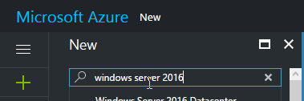

Vyberte image **Windows Server 2016 Datacenter** od Microsoftu.

Ujistěte se, že je jako *deployment model* je vybrán **Resource Manager** a klikněte **Create**.

Vyplňte údaje o virtuálním stroji:

1. libovolný **název** (bez mezer a zvláštních znaků),
2. **VM disk type** změňte na **HDD**,
3. libovolné **Username** a **Password** (tak, abyste si je zapamatovali - budou za chvíli potřeba),
4. **Subscription** ponechte (pokud máte účtů několik, zvolte ten preferovaný),
5. vytvořte novou (Create new) **Resource Group** s libovolným názvem,
6. ujistěte se, že **Location** je **North Europe**, případně změňte,
7. potvrďte **OK**.

Zvolte si, jaký výpočetní výkon bude virtuální stroj mít. Čím výkonnější, tím dražší bude. Pro naše potřeby bude stačit **A2_V2 Standard**. Abyste zobrazili všechny možné konfigurace, klikněte na **View all**.


Potvrďte tlačítkem **Select**.

Nastavení v kroku **3** ponechte beze změny a potvrďte **OK**.

Počkejte, než skončí kontrola konfigurace, a potvrďte **OK**.

Během několika minut se vytvoří a nastartuje nový virtuální stroj.

### 2. Konfigurace VM ze strany Azure

Nejprve virtuálu přiradíme DNS jméno, abychom si nemuseli pamatovat jeho IP adresu.

1. V sekci **Essentials** klikněte na adresu **pod Public IP address/DNS name label**

   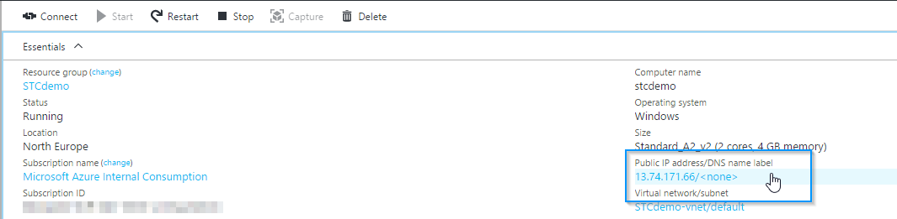

2. Vyplňte **DNS name label** tak, aby reprezentoval unikátní adresu v internetu.

   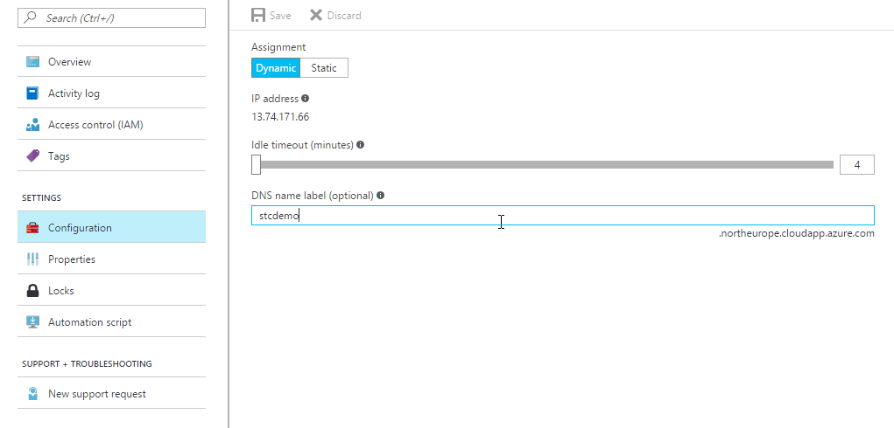

3. Potvrďte tlačítkem **Save**.

4. Vraťte se zpět na přehled virtuálního stroje.

Druhá věc, kterou je potřeba nastavit ze strany Azure, je **firewall**. Budeme provozovat webový server, proto potřebujeme TCP port 80.

1. Vraťte se zpět do přehledu virtuálního stroje a v nabídce vlevo vyberte **Network interfaces**.

   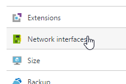

2. Zvolte první síťový adaptér v seznamu (měl by tam být jediný).

3. V sekci **Essentials** klikněte na **Network security group**.

   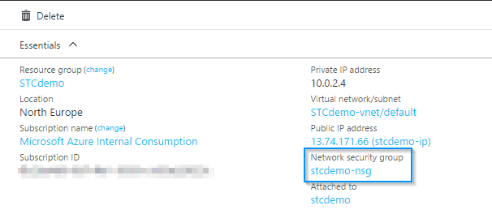

4. Klikněte na text **Inbound security rule**.

5. Kliněte **Add**.

6. Jako **Name** zadejte **Web**.

7. Zkontrolujte, že je nastavený protokol **TCP**, port range **80** a action **Allow**.

   ​	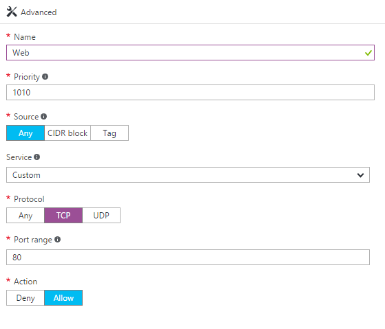

8. Potvrďte **OK**.

Právě jsme ve firewallu na úrovni datacentra Azure povolili prostup na port 80 našeho vitruálního stroje.

### 3. Konfigurace VM "zevnitř"

Nyní nastavíme Windows Server 2016 na hostování webových aplikací pomocí IIS.

Na svém počítači spusťte nástroj **Připojení ke vzdálené ploše** (Remote Desktop Connection).

Zadejte DNS adresu, kterou jste si zvolili v průběhu konfigurace (celou - včetně northeurope.cloudapp.azure.com) a klikněte **Připojit** (Connect).

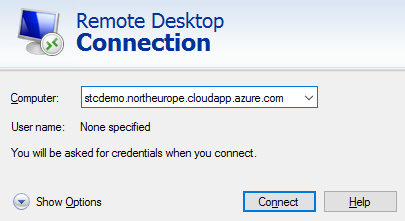

V přihlašovacím dialogu zadejte jméno a heslo, které jste si zvolili, a následně potvrďte, že se chcete připojit k virtuálu navzdory nedůvěryhodnému certifikátu.

> Je možné, že budete muset zadat jiné přihlašovací jméno, než jaké máte ve Windows. Uděláte to přes "More choices" a "Use a different account".
>
> 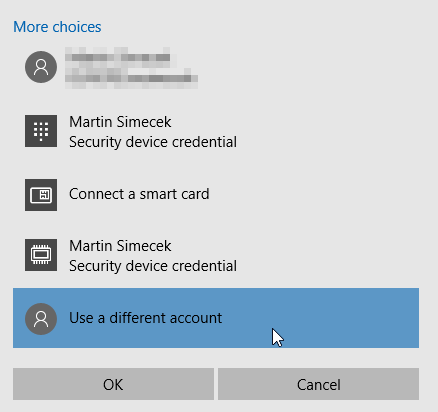
>
> Uživatelské jméno musí obsahovat i název počítače, ke kterému se přihlašujete, jako doménu. Např.:
>
> `mujvm\msimecek`

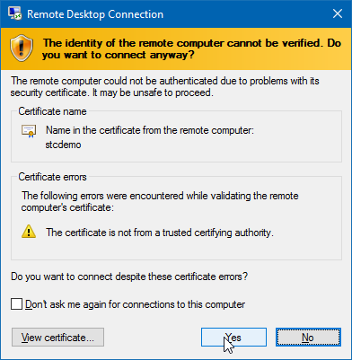

Otevře se plocha vzdáleného počítače a postupně se načte Server Manager.

Spusťte **PowerShell** z nabídky Start a zadejte:

```powershell
Install-WindowsFeature -name Web-Server -IncludeManagementTools
```

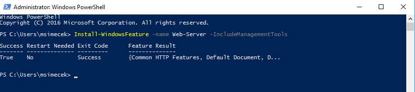

### 4. Ověření funkčnosti

Když teď vložíte do webového prohlížeče adresu svého serveru, otevře se uvítací stránka IIS:

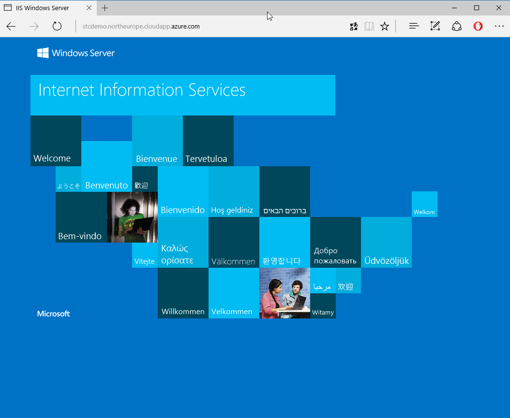

### (volitelně) 5. Vlastní webová stránka

Budete-li mít náladu a čas, zkuste upravit stránku, která se na serveru zobrazuje. Adresář najdete na disku C:

`C:\inetpub\wwwroot` 

### (důležité) 6. Vypnutí

Jakmile budete s virtuálem hotovi, nezapomeňte ho **vypnout přes portál **tlačítkem **Stop**! 

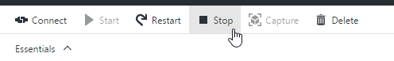

## Závěr

Nyní máte funkční virtuální počítač s Windows Server 2016 Datacenter, kde běží webový server připravený pro vaše aplikace. Můžete do něj také nainstalovat cokoliv - například Visual Studio a používat jej pro vývoj a testování.