# Aplikační platforma - App Service

App Service je základem pro mnoho dalších Azure služeb. Jedná se primárně o webový hosting, na kterém můžete provozovat webové aplikace a API napsaná pomocí technologií .NET, PHP, Node.js, Python nebo Java.

## Cvičení 2

Cílem tohoto cvičení je ukázat si, jak se vytváří Azure App Service a jak se do něj nasazují webové aplikace.

Klíčové kroky:

* vytvořit Web App
* nahrát na ni jednoduchý PHP skript přes Kudu
* nahrát na ni aplikaci z Visual Studia přes Publish
* (volitelně) zkusit Remote Debugging
* ručně škálovat na 3 instance
* (volitelně) automaticky škálovat na základě využití procesoru
* přepnout zpátky na Free


### 0. Příprava

Pokud ještě nemáte nainstalované Visual Studio, stáhněte si [instalátor Visual Studio 2017 Community](https://www.visualstudio.com/thank-you-downloading-visual-studio/?sku=Community&rel=15) a nastartujte instalaci. V okně s výběrem technologií zaškrtněte určitě **Web Apps**. Zbytek je volitený, čím více toho bude, tím déle bude instalace trvat a vezme více místa na disku.

Až instalace skončí, spusťte Visual Studio a přihlašte se.

### 1. Tvorba Web App

Podobně jako u cvičení 1 bude nejprve nutné založit webovou aplikaci přes portál Azure.

Přihlašte se na [portál Microsoft Azure](https://portal.azure.com).

Klikněte na **New** a vyhledejte "*Web App*".

Vyberte tu první od Microsoftu.

Klikněte **Create** (vidíte, že tady není na výběr deployment model, protože u Web App je to pouze Resource Manager).

Vyplňte údaje o webové aplikaci:

1. unikátní **název** (bez mezer a zvláštních znaků - půjde do URL),

2. **Subscription** ponechte (pokud máte účtů několik, zvolte ten preferovaný),

3. vytvořte novou (Create new) **Resource Group** s libovolným názvem,

4. klikněte na **App Service plan/Location**,

5. klikněte **Create New**,

   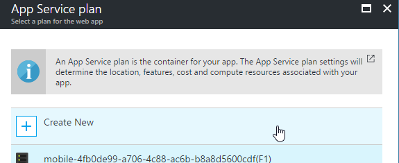

6. zadejte libovolný **název**,

7. jako **Location** vyberte **North Europe** (ať je nám co nejblíž),

8. jako **Pricing tier** vyberte **Free**,

   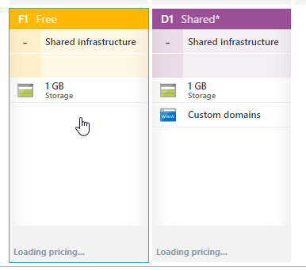

9. potvrďte **Select**,

10. ​potvrďte **OK**,

11. **Application Insights** ponechte na **Off**,

12. potvrďte **Create**.

Během několika vteřin se vytvoří Web App.

> Všimněte si, že tvorba Web App trvala znatelně kratší dobu něž virtuálního stroje. Je to proto, že v Azure je neustále připraveno několik serverů pro Web Apps a pouze se vám přiřadí (není potřeba je v datacentru umísťovat do racku a spouštět).

Za tuto aplikaci se vám z kreditu nic nestrhne.

> Na rozdíl od virtuálních strojů mají Web Apps variantu Free a lze je tedy provozovat úplně zadarmo. Nese to s sebou ale jistá funkční omezení (např. na ně nelze nasměrovat vlastní doménu).

V detailu webu, v sekci **Essentials** najdete jeho **URL adresu**. Když na ni kliknete, otevře se výchozí stránka, kterou dodává Azure.

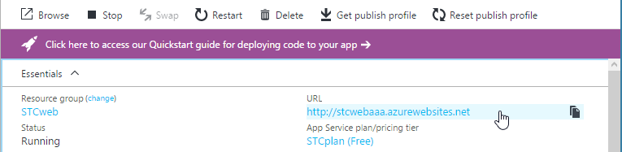

### 2. Nasazení aplikace přes Kudu

Nyní je webhosting připravený. Nemuseli jsme nastavovat firewall ani instalovat IIS, protože vše už je předkonfigurováno. Zbývá jenom nahrát náš web.

Připravte si dynamickou webovou stránku, třeba v PHP:

1. Otevřete [Visual Studio Code](https://code.visualstudio.com/) nebo třeba Poznámkový blok.

2. Do nového souboru napište:

   ```php
   <?php
     echo "<h1>Hello, " . "World</h1>";
     phpinfo();
   ?>
   ```

3. Uložte ho jako **index.php**.

4. Přejděte na adresu svého nového webu (např. `http://stcwebaaa.azurewebsites.net/`).

5. Přidejte do adresy **.scm.** před segment azurewebsites.net (např.: `http://stcwebaaa.scm.azurewebsites.net`).

6. Otevře se tzv. **Kudu** konzole, která nám dává nahlédnout do útrob App Service.

7. Klikněte myší nahoře na **Debug console** a vyberte **CMD**.

8. Klikněte na **site** a potom **wwwroot**.

9. Najděte u sebe na disku soubor **index.php** a přetáhněte jej nad seznam souborů v Kudu.

10. Přejděte v prohlížeči znovu na původní adresu webu.

11. Měli byste vidět nadpis Hello, World a informace o PHP.

    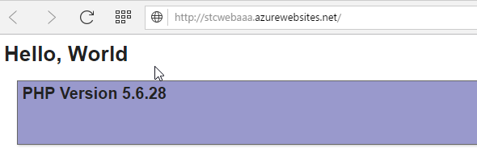

### 3. Nasazení aplikace z Visual Studia

V praxi se tímto způsobem aplikace na Web App nenasazují. Lepší a efektivnější je použít např. Visual Studio nebo Visual Studio Team Services.

1. Spusťte **Visual Studio 2017**. Pokud bude vyžadovat přihlášení, použijte stejný Microsoft Account, který používáte pro Azure.

2. V sekci **New project** vyhledejte "web application" a vyberte **ASP.NET Web Application (.NET Framework)**. Dejte pozor, v tomto případě netvoříme ASP.NET Core Web Application!

   ​		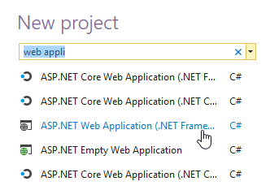

3. Pojmenujte si projekt dle libosti a potvrďte.

4. V dialogu typu aplikace zvolte **MVC**.

   ​	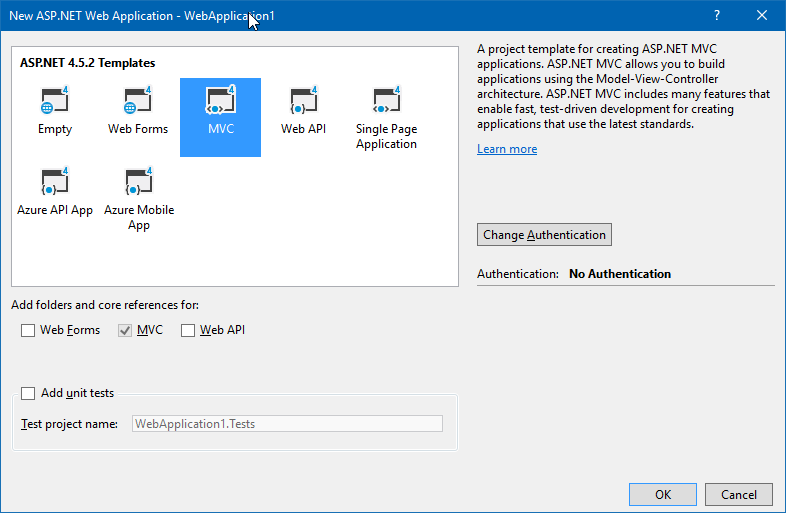

5. Potvrďte **OK**.

6. Jakmile se projekt vytvoří, stiskněte **F5** a ověřte, že web běží lokálně na vašem počítači.

   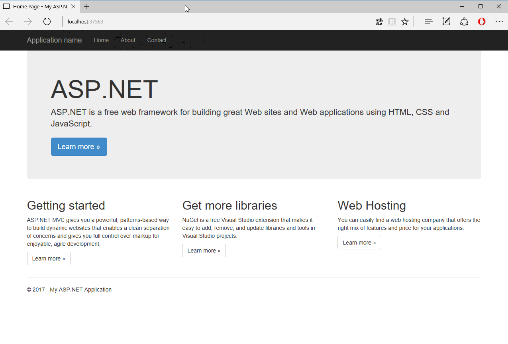

7. Zastavte aplikaci tlačítkem **Stop Debugging**  (Shift+F5) ve Visual Studiu.

   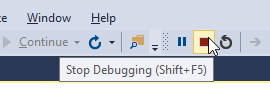

Nyní přichází čas na publikování webu do Azure Web App.

1. V panelu **Solution Explorer** klikněte pravým tlačítkem na projekt a zvolte **Publish...**

   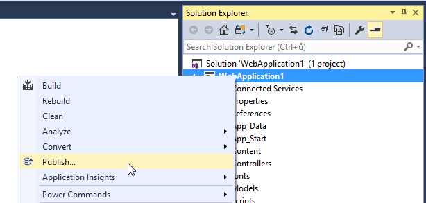

2. Ujistěte se, že je vybrána položka **Microsoft Azure App Service** a přepněte pod ní na **Select Existing**.

3. Klikněte **Publish**.

4. Počkejte, až se načte seznam Resource Group a vyberte tu, kde máte nasazenou svou aplikaci.

   1. Máte-li více Azure účtů, dejte si pozor, jestli je zvolen ten správný.

5. Zvolte svou aplikaci a klikněte **OK**.

   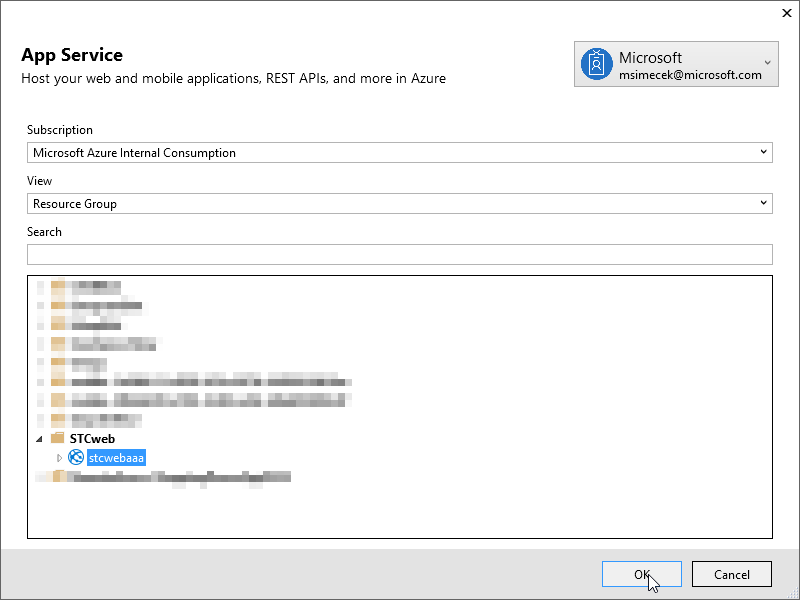

Stáhne se tzv. **Publish Profile** a aplikace se vypublikuje na Azure. Jakmile proces skončí, web se otevře v prohlížeči. Tentokrát již na finální adrese (azurewebsites.net).

Až provedete na webu nějaké změny a budete ho publikovat příště, stačí už jenom kliknout na Publish a potvrdit. Konfigurace je uložena v projektu.

### 4. Škálování

V posledním cvičení se přepneme zpět do portálu a budeme přidávat a odebírat výpočetní výkon našeho webu. V tomto případě použijeme scale-out i scale-up.

> **Škálování do šířky (scale-out)** znamená, že rozložíme stejnou aplikaci na několik serverů.
>
> **Škálování do výšky (scale-up)** znamená, že aplikace běží na jednom serveru, ale ten má více výkonu (CPU, RAM...).

Na [portále Azure](https://portal.azure.com) přejděte do nastavení svého webu (pokud jste ho nezavřeli, mělo by být po ruce v prohlížeči).

Klikněte na **Scale out** v sekci SETTINGS.

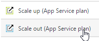

Vidíte, že nemůžete nic nastavit. To je jedno z omezení Free plánu. Přepneme proto nyní na okamžik web do režimu **Standard**.

> Jakmile přeškálujete na jinou úroveň výkonu - Free > Shared > Basic > Standard, začíná vám ubývat kredit. Jinými slovy: platíte za výpočetní výkon.

Klikněte na **Scale up**.

Zvolte **S1 Standard** a potvrďte tlačítkem **Select**.

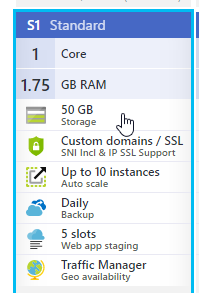

Vaše aplikace bude nyní přesunuta na nový server, kde dostane víc výkonu a možnost škálování.

Až vám portál oznámí, že App Service plan byl aktualizován, klikněte znovu na **Scale out**.

Nastavte ručně **dvě instance**.

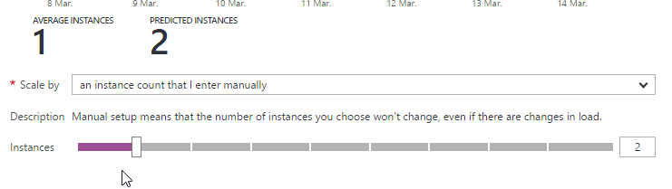

Potvrďte tlačítkem **Save**.

Vaše aplikace nyní běží na dvou serverech a Azure mezi ně rovnoměrně rozděluje zátěž.

*(volitelně)* Zkuste zaexpermentovat s dalšími možnostmi v rozbalovátku **Scale by**. Skrývá se tam možnost automatického škálování např. podle vytížení CPU.

### 5. Zpět na Free

Po skončení experimentů můžete web přepnout zpátky do režimu Free.

1. **Scale up**
2. **Free**
3. **Select**

## Závěr

Nyní umíte vytvořit čistě platformový webhosting, u kterého se nemusíte starat o server - pouze nasadit aplikaci. A to jste taky udělali pomocí Visual Studia. Dál jste se naučili, jak webové aplikaci přidávat výkon a jak ji rychle roložit na více serverů.