# Aplikační platforma - Azure Functions

TODO

## Cvičení 

* vytvořit timed-based Azure Function
  * ukázat si CRON (spouštění každých 20 vteřin)
* vytvořit Function na Storage Trigger
  * jakmile se do Blob Storage nahraje obrázek, funkce se spustí
  * změní jeho velikost a uloží do výstupního Storage
  * dá se použít připravený C# sample na resize obrázků

### 1. Time-based Azure Function

První funkce, kterou vytvoříme, ještě nebude nijak zvlášť sofistikovaná. Na základě časovače se automaticky spustí v zadaném intervalu.

Přihlašte se na [portál Microsoft Azure](https://portal.azure.com).

Klikněte na **New** a vyhledejte "*Function App*".

Vyberte tu první od Microsoftu.

Klikněte **Create** (vidíte, že ani tady není na výběr deployment model, protože u Function App je to pouze Resource Manager).

Vyplňte údaje Function App:

1. unikátní **název** (stejně jako u Web App),
2. **Subscription** ponechte (pokud máte účtů několik, zvolte ten preferovaný),
3. vytvořte novou (Create new) **Resource Group** s libovolným názvem,
4. jako **Hosting Plan** ponechte **Consumption**,
5. **Location** změňte na **North Europe**,
6. **Storage Account** ponechte,
7. potvrďte tlačítkem **Create**.

Po vytvoření přejděte do své nové Function App.

Zvolte **Timer** > **C#** a klikněte na **Create this function**.

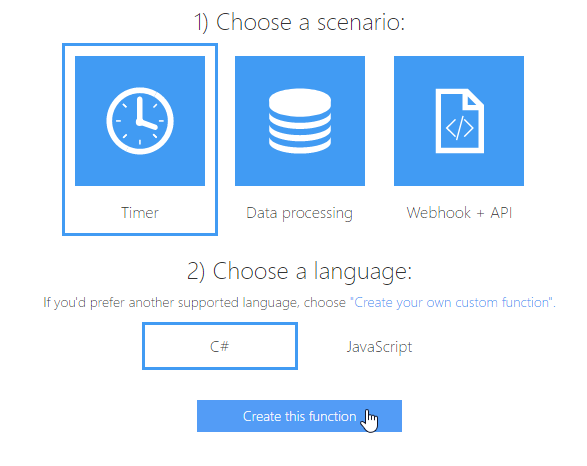

Otevře se editor zdrojového kódu funkce. Zatím ho necháme beze změny a přejdeme na záložku **Integrate**.

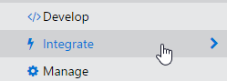

Důležité je nastavení **Schedule**, které říká, jak často se bude funkce spouštět. Používá se zde tzv. CRON expression ve formátu:

`{second} {minute} {hour} {day} {month} {day-of-week}`

Spuštění každých 5 minut by vypadalo takto:

`0 */5 * * * *` (= každou **nultou** (0) sekundu v **pětiminutových** krocích (*/5) **jakékoliv** hodiny, dne, měsíce a dne v týdnu)

Pro srovnání - spuštění v každé páté minutě by vypadalo takto:

`0 5 * * * *`

Změňte **Schedule** tak, aby se funkce spouštěla každých 20 vteřin:

 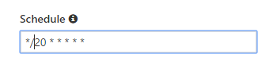

Potvrďte tlačítkem **Save**.

Když nyní přejdete zpátky na záložku **Develop** a rozbalíte dole panel **Logs**, uvidíte, že se funkce spouští každých 20 vteřin.

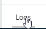

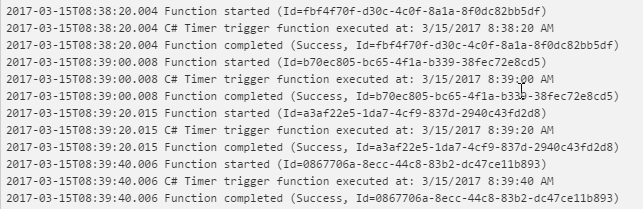

### 2. Storage Trigger

Druhá funkce bude akčnější - spustí se pokaždé, když do Blob Storage nahrajeme obrázek a změní jeho rozměry.

1. Vlevo v menu klikněte na **New Function**.

2. Z nabídky **Scenario** vyberte **Samples**.

   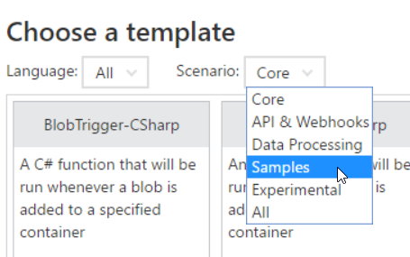

3. Zascrollujte dolů a najděte šablonu s názvem **ImageResizer-CSharp**.

   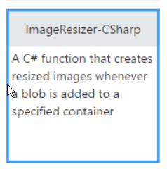

4. Pod tabulkou si zvolte **název** (např. Resizer).

5. Zbytek nechte beze změny a klikněte na **Create**.

Funkce je připravena, můžete si prohlédnout její kód.

Abychom otestovali, jak funguje, budeme muset do Azure Storage nahrát obrázek. Použijeme k tomu nástroj, který se jmenuje [Microsoft Azure Storage Explorer](http://storageexplorer.com/).

1. Stáhněte a nainstalujte [Storage Explorer](http://storageexplorer.com/).

2. Spusťte jej a přihlašte se svým Azure účtem.

   1. Případně klikněte na ikonku **Connect to Azure Storage**.

3. Po přihlášení se vám načte seznam Storage Accountů na vašem účtu. V seznamu budete muset vybrat ten správný. Abyste ho identifikovali, nahlédněte v Azure portále na Resource Group, kde běží vaše funkce. Nad ní nebo pod ní bude i Storage Account.

   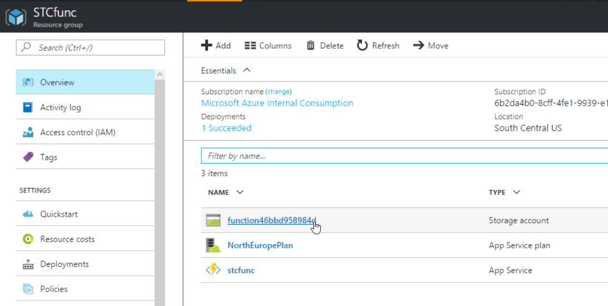

   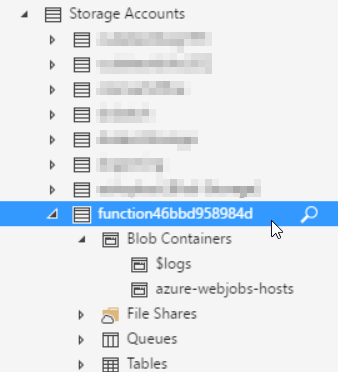

4. Klikněte pravým tlačítkem na **Blob Containers** a vyberte **Create Blob Container**.

5. Pojmenujte ho "**sample-images**".

6. Nahrajte do něj obrázek tlačítkem **Upload > Upload Files...**

7. Na pozadí se automaticky spustila funkce a za okamžik uvidíme výstup. Klikněte znovu pravým tlačítkem na **Blob Containers** a zvolte **Refresh**.

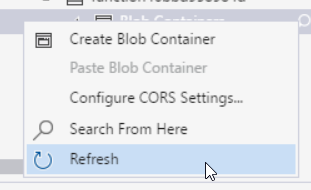

7. Objeví se dva nové kontejnery: sample-images-md a sample-images-sm. V nich najdete výsledné obrázky.

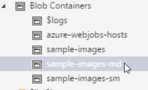

8. Na portále Azure, pod oknem se zdrojovým kódem funkce, najdete v Logs informaci o tom, že funkce byla spuštěna.

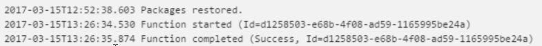

## Závěr

Ukázali jsme si, jak pouze s pomocí portálu a zdrojového kódu vytvořit serverovou aplikaci a nechat ji reagovat na události. Azure Functions se dají řetězit i za sebe a předávat si data prostřednictvím Storage nebo front.