# Cloudová inteligence - Emotion API

ABCD

Klíčové kroky:

* vytvořit v Azure Emotion API,
* vytvořit Azure Function,
* zajistit napojení na vstupní a výstupní Storage Container,
* napsat kód, který bude posílat obrázek ze vstupu na Emotion API a uloží výsledky do textového blobu.

## 0. Příprava

V tomto cvičení budeme pracovat s úložištěm souborů Azure Storage. Pokud ho ještě nemáte, nainstalujte si nástroj [Azure Storage Explorer](http://storageexplorer.com/). Po spuštění aplikace se přihlašte účtem, na němž máte Azure.

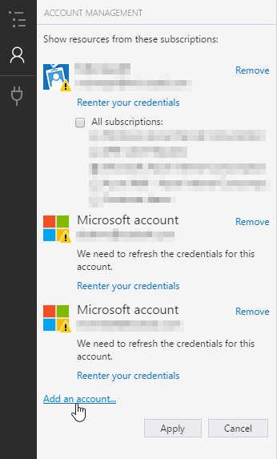

## 1. Získání klíče k API

Přihlašte se na [portál Microsoft Azure](https://portal.azure.com).

Klikněte na **New** a vyhledejte *"Cognitive Services"*.

Vyberte **Cognitive Services** od Microsoftu a klikněte na **Create**.

Vyplňte formulář:

1. **název** tak, abyste rozuměli, k čemu konkrétní API bude sloužit. V našem případě třeba "*Emotions*",
2. zvolte své předplatné Azure,
3. jako **API Type** vyberte *Emotion API (preview)*,
4. **Location** ponechte *West US* (jiná aktuálně na výběr není),
5. **Pricing tier** bude *F0* (který je zdarma),
6. **Resource group** založte novou (*Create new*),
7. potvrďte tlačítkem **Create**.

Po několika vteřinách se vytvoří nový účet pro Emotion API. 

> Každá kategorie služeb v Cognitive Services se registruje zvlášť. Až budete chtít například Computer Vision kvůli OCR, projdete stejný postup, jenom místo Emotion API zvolíte Computer Vision.

Jakmile se Emotion API vytvoří, přejděte do nové Resource Group a klikněte na něj. Potom v levém menu vyberte **Keys**.

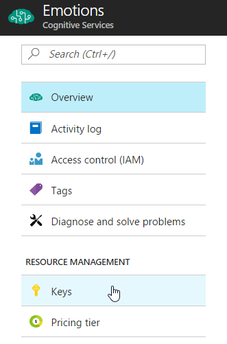

Zkopírujte **KEY 1** a schovejte si ho třeba do Poznámkového bloku (Notepadu).

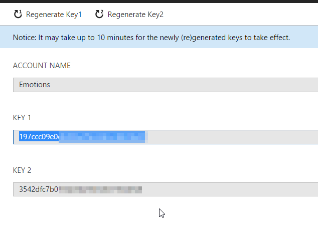

Jak se píše nad klíčem, může chvíli trvat, než bude aktivní. Kdybyste se pokusili volat API hned, dojde k chybě. My ale teď máme ještě práci, takže až se k němu vrátíme, bude fungovat.

## 2. Tvorba Function App

O procesování  obrázků se bude starat Azure Function. To je rozdíl oproti minulé hodině, kdy přesouváme zdrojový kód mimo svůj počítač a používáme tzv. "serverless" technologii.

1. Na portále Azure se vraťte do **Resource Group**, kde už máte Emotion API a klikněte **Add**.
2. Vyhledejte **Function App**, vyberte tu od Microsoftu a klikněte **Create**.
3. Vyplňte **unikání název** (stejně jako u webové aplikace).
4. Zkontrolujte správný účet (Subscription) a Resource Group.
5. **Hosting Plan** ponechte jako **Consumption Plan**.
6. **Location** změňte na **North Europe**.
7. Volbu **Storage** ponechte na **Create New** s vygenerovaným názvem.
8. Potvrďte formulář tlačítkem **Create**.

Po chvíli se vytvoří vše potřebné pro hostování našeho kódu.

Vyberte nově vytvořenou Function App (poznáte ji podle názvu a ikony s bleskem).

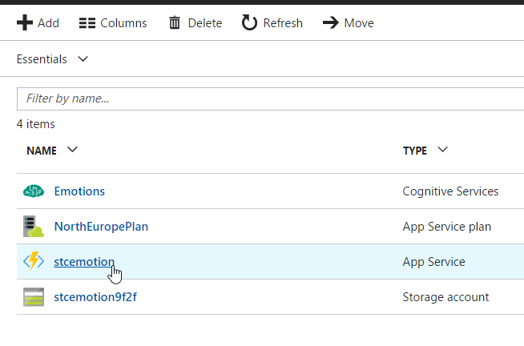

Přijdejte novou funkci tlačítkem **+** vedle **Functions**.

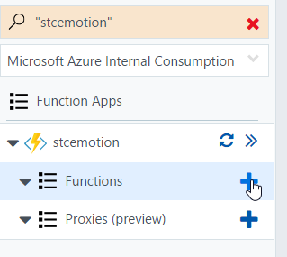

V sekci **Get started on your own** klikněte na **Custom function**.

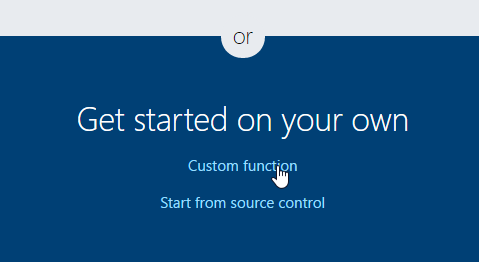

Vyberte **BlobTrigger-CSharp**.

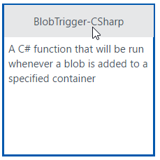

Pojmenujte funkci **DetectEmotions** a změňte **Path** na `images/{name}`.

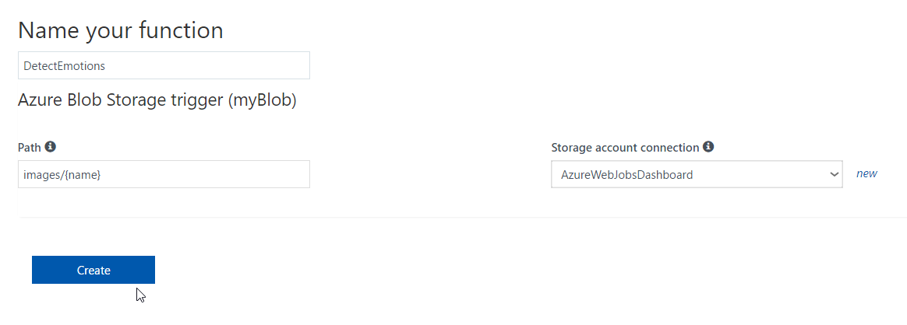

Klikněte na **Create**.

Vytvoří se nová Azure Function, která bude reagovat na nové obrázky v Azure Storage. Jakmile se v kontejneru "images" objeví nový soubor, funkce si ho vyzvedne a zpracuje. Jejím úkolem tedy bude předat obrázek dál na Emotion API a získat výsledky.

Aby proces fungoval, musíme ještě doplnit druhou část integrace. Nyní máme vstup (= soubor nahraný do *images*) a budeme potřebovat výstup.

1. Klikněte na záložku **Integrate**.

   ​	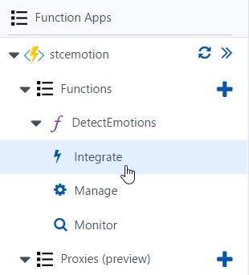

2. Ve sloupci **Outputs** klikněte na **New Output** a vyberte **Azure Blob Storage**.

   ​	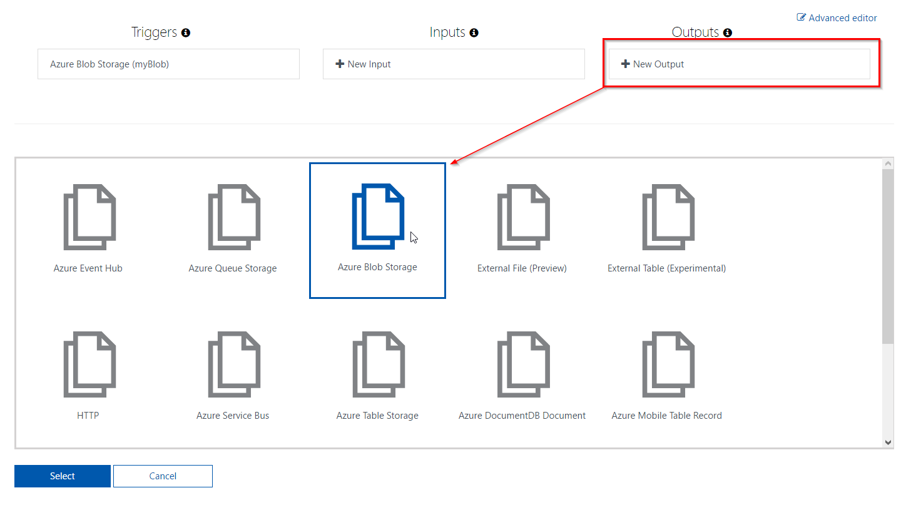

3. Potvrďte tlačítkem **Select**.

4. Volby výstupu ponechte beze změny a klikněte **Save**.

   ​	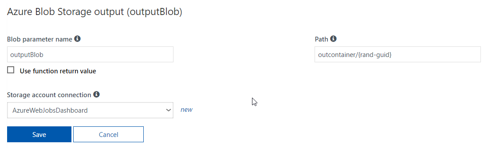

Vraťte se zpět do funkce **DetectEmotions** a nahraďte signaturu metody **Run** tak, aby v ní byl nově přidaný výstup:

```c#
public static void Run(Stream myBlob, string name, out string outputBlob, TraceWriter log)
{
    log.Info($"C# Blob trigger function Processed blob\n Name:{name} \n Size: {myBlob.Length} Bytes");
}
```

Základ je nyní připraven, můžeme volat API.

> Kdybyste kdykoliv měnili vstupy a výstupy, je potřeba patřičně upravit metodu Run - včetně názvů parametrů, které musí odpovídat těm, které jsou na záložce Integrate.

## 3. Volání API

K volání Emotion API použijeme standardní třídu HttpClient, která je součástí .NET (Frameworku i Core). Připravíme si nejprve metodu, která pošle požadavek a vrátí odpověď.

Pod metodu Run (až za druhé složené závorky) vložte **novou metodu**:

```c#
static async Task<string> GetEmotions(Stream image, TraceWriter log) 
{
    using (var client = new HttpClient())
    {
        client.DefaultRequestHeaders.Add("Ocp-Apim-Subscription-Key", Environment.GetEnvironmentVariable("EmotionApiKey"));

        var content = new StreamContent(image);
        content.Headers.ContentType = new MediaTypeHeaderValue("application/octet-stream");

        var httpResponse = await client.PostAsync("https://westus.api.cognitive.microsoft.com/emotion/v1.0/recognize", content);
 
        if (httpResponse.StatusCode == HttpStatusCode.OK){
            return await httpResponse.Content.ReadAsStringAsync();
        }
        else {
            log.Error(await httpResponse.Content.ReadAsStringAsync());
        }
    }

    return null;
}
```

A nyní jenom stručná náplň metody Run:

```c#
public static void Run(Stream myBlob, string name, out string outputBlob, TraceWriter log)
{
    var emotions = GetEmotions(myBlob, log).Result;
    
    log.Info(emotions);
    outputBlob = emotions;
}
```

To ale samo o sobě ještě nestačí - protože používáme objekty z knihoven .NET Frameworku, musíme úplně nahoru doplnit patřičné **using**:

```c#
using System.Net;
using System.Net.Http.Headers;
```

Přestože je kód hotový, naše práce ještě neskončila. Když se podíváte podrobněji na kód, který tvoří volání Emotion API, uvidíte, že nastavujeme hlavičku `Ocp-Apim-Subscription-Key`. Její hodnota pochází z proměnné prostředí nazvané `EmotionApiKey`.

```c#
client.DefaultRequestHeaders.Add("Ocp-Apim-Subscription-Key", Environment.GetEnvironmentVariable("EmotionApiKey"));
```

> To je dobrá praxe při tvorbě skutečných aplikací - minimalizovat výskyt konfiguračních a přihlašovacích údajů přímo v kódu.

Pojďme teď EmotionApiKey nastavit:

1. Opusťte editor kódu a klikněte na název vaší Function App v levém panelu.

   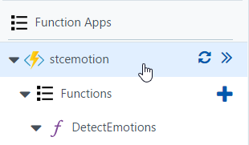

2. Přejděte na záložku **Platform Features** a poté **Application settings**.

   ​	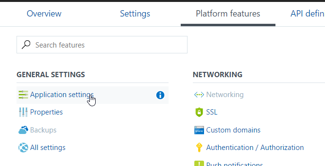

3. Zascrollujte kousek dolů do části **App settings**.

4. Přidejte novou hodnotu s názvem **EmotionApiKey**.

5. Do políčka **Value** zkopírujte kód svého Emotion API.

   ​	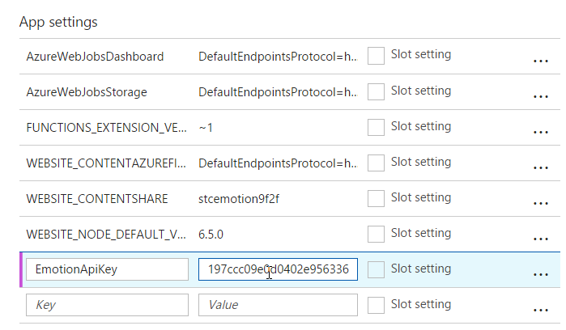

6. Uložte změny nahoře tlačítkem **Save**.

## 4. Zkouška

Je na čase naši funkci otestovat. Spusťte **Storage Explorer** a najděte svůj nedávno vytvořený **Storage Account** (název jsme nechávali generovat v kroku tvorby Azure Function).

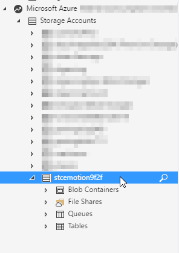

Klikněte pravým tlačítkem na **Blob Containers** a vyberte **Create Blob Container**.

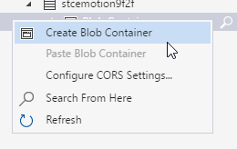

Pojmenujte ho "*images*".

Opakujte stejný postup ještě jednou, jenom teď se bude kontejner jmenovat "*outcontainer*".

Nahrajte do *images* fotku, kde **jsou obličeje lidí**. Dejte pozor, aby nebyla příliš velká - Emotion API má limit na velikost souboru a my ho ve funkci nijak neupravujeme. **Obrázek nesmí být větší než 4 MB.**

Za pár vteřin najdete v *outcontainer* soubor, který když otevřete pomocí Poznámkového bloku, přečtete si výsledek: kde jsou obličeje a jaké na nich byly detekovány emoce.

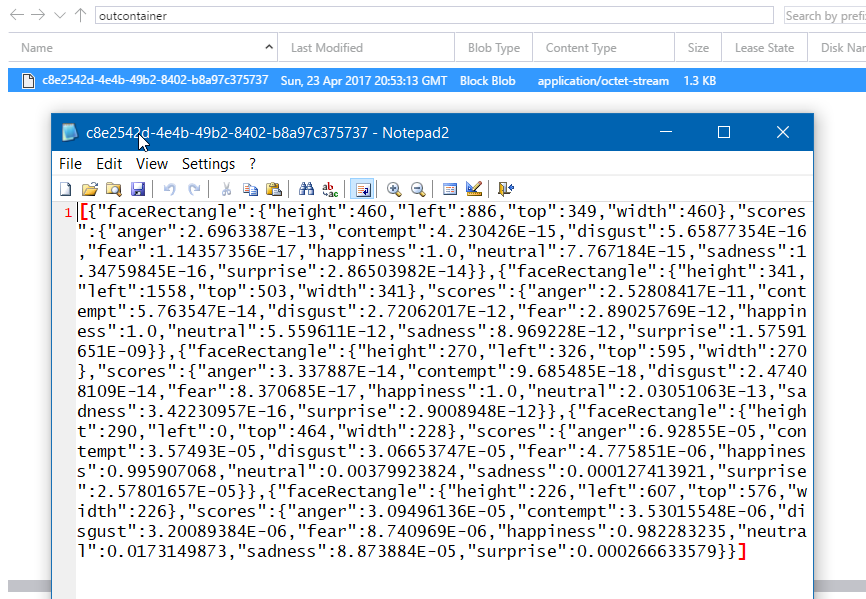

## 5. Log

Azure Functions jsou výborné pro iterativní ladění - napíšete kus kódu a hned vidíte, jestli je v pořádku, nebo ne. Stejně tak je dobré mít v průběhu přehled o dění ve funkci. K tomu slouží **Logy**.

Najdete je schované **pod editorem kódu**:

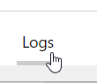

A protože jsme do funkce přidali i řádek, který do logu zapisuje, uvidíte v něm výsledky taky:

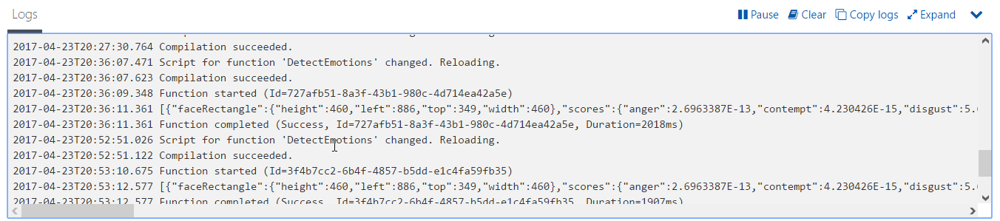

Pokud vaše funkce nedělá, co má, jsou logy nejlepším místem, kde začít s lovením chyb.