# Cloudová inteligence - QnA Maker / LUIS

V rámci tohoto cvičení si ukážeme, jak vytvořit základní infrastrukturu pro porozumění lidské řeči. Použijeme dvě služby: QnA Maker a LUIS (Language Understanding Intelligent Service).

Klíčové kroky:

* vytvořit novou službu v QnA Makeru,
* naplnit zdrojovými daty,
* otestovat a vypublikovat API,
* zaregistrovat se na Luis.ai,
* vytvořit nový model,
* vypublikovat a otestovat.

## 1. Nová služba v QnA Makeru

QnA Maker slouží k rychlémua jednoduchému vytvoření API nad otázkami a odpověďmi ("často kladené dotazy" nebo "FAQ", "Q/A" na webových stránkách). My pro účely tohoto cvičení vytvoříme bota, který bude opdovídat na otázky kolem podpory Microsoft Azure.

Přejděte v prohlížeči na web [QnAMaker.ai](https://qnamaker.ai/).

Klikněte na **Create new service**.

**Přihlašte se** svým Microsoft Accountem (třeba tím, na němž máte registrovaný Azure, ale není to podmínkou).

**Potvrďte**, že souhlasíte s podmínkami Microsoft Cognitive Services.

Vyplňte formulář:

* **Service name** si zvolte tak, aby vám dával smysl - např. **Azure Support**.
* Do **FAQ URLs** vložte https://azure.microsoft.com/en-us/support/faq/.
  * všimněte si, že zdrojů může být i několik,
  * všimněte si, že zdrojem může být třeba i dokument Wordu.
* Klikněte dole na **Create**.

QnA Maker nyní projde všechny zdroje, které jste zadali, a pokusí se v nich identifikovat otázky a odpovědi. Následně vyplní Knowledge Base.

> Aby hledání otázek a odpovědí bylo úspěšné, musí být dokument správně naformátovaný. Např. ve Wordu je dobré oddělit otázky třeba tučně a zakončit je otazníkem, v HTML dobře funguje využití podnadpisů. Systém nemá problém, pokud jsou odpovědi skryté JavaScriptem, neporadí si ale s těmi, které nejsou na stránce vůbec.

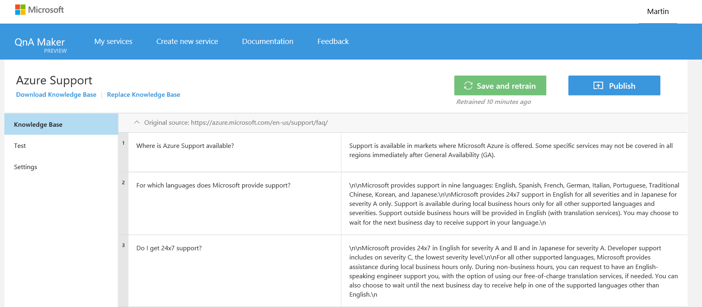

Vidíte, že hlavně odpovědi nejsou úplně ideální - míchají se do nich HTML značky a formátování. Součástí vývoje je pokaždé taky postupné ladění a úpravy.

1. Klikněte na řádek 3 a upravte odpověď tak, aby neobsahovala přebytečné `\n\n`.

   ​	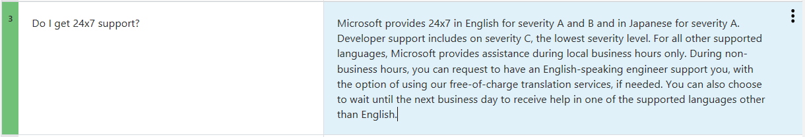

2. Klikněte na **Save and retrain**.

3. V levé nabídce klikněte na **Test**.

4. Vyzkoušejte pár vět (např. "24x7 support?").

   ​	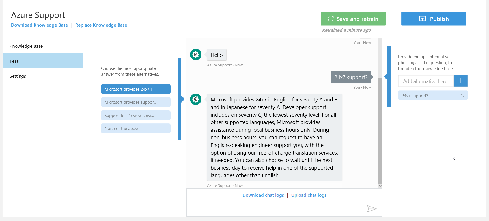

U každé odpovědi máte možnost vlevo zvolit vhodnější variantu a tím zpřesnit budoucí reakci na podobnou otázku.

Nakonec klikněte vpravo nahoře na tlačítko **Publish**.

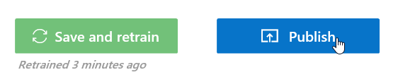

A potvrďte znovu **Publish**.

Portál vám vygeneruje ukázkový HTTP požadavek na vaši právě vytvořenou bázi znalostí.

```
POST /knowledgebases/7a644e84-d571-41fb-a937-a48cff8a4d92/generateAnswer
Host: https://westus.api.cognitive.microsoft.com/qnamaker/v1.0
Ocp-Apim-Subscription-Key: 9bca177fa5d8aaaaaaaaaaaaaa
Content-Type: application/json
{"question":"hi"}
```

Když ho pak správně zadáte například do aplikace [Fiddler](http://www.telerik.com/fiddler) nebo [Postman](https://www.getpostman.com/):

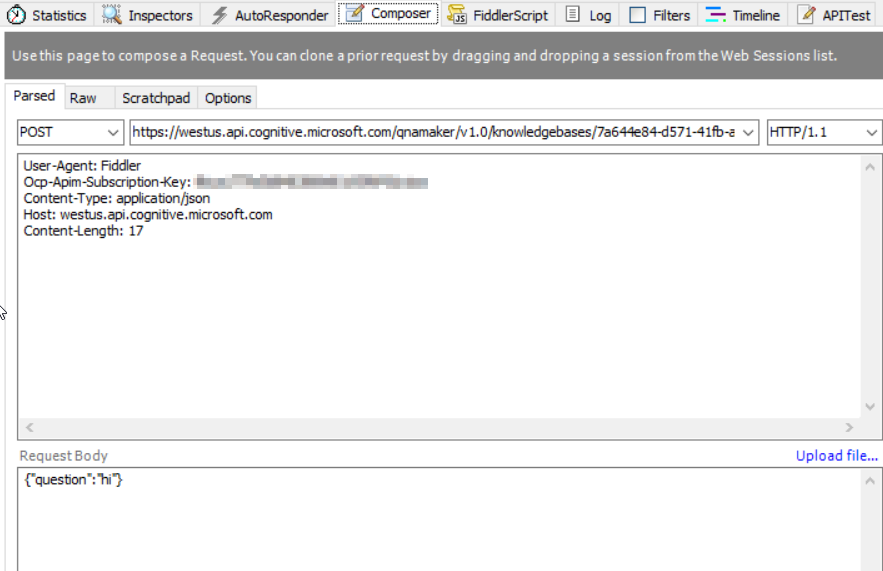

Získáte odpověď:

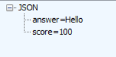

## 2. LUIS

Nyní posuneme své snažení na vyšší úroveň. Služba LUIS.ai je součástí Microsoft Cognitive Services a umožňuje vytvoření vlastního modelu pro porozumění lidské řeči (ve formě psaného textu). Pracuje s tzv. intenty a entitami.

> **Intent** určuje **co** chceme dosáhnout.
>
> **Entita** je objekt, s nímž pracujeme.
>
> Např. ve větě "Jaké počasí je v Praze?" může být intentem "aktuální_počasí" a entitou "Praze".

V tomto cvičení navážeme na Azure a vytvoříme model pro příkazy vypínání a zapínání virtuálních strojů. V praxi by ho potom mohl použít třeba chatbot.

1. Otevřete v prohlížeči web [Luis.ai](https://www.luis.ai/).

2. Klikněte na **Sign in or create an account**.

3. Přihlašte se svým účtem Microsoft Account (třeba tím, na který máte zaregistrovaný Azure).

4. Pokud na vás vyskočí nabídka tutoriálu, zavřete ji křížkem.

5. Klikněte na **New App**.

   ​	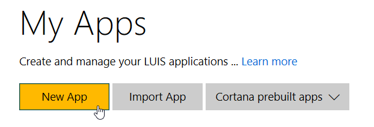

6. Pojmenujte aplikaci třeba **AzureVm**.

7. Podívejte se, jaké jazyky jsou k dipozici (čeština chybí) a zvolte **English**.

8. Ostatní položky přeskočte a klikněte **Create**.

   ​	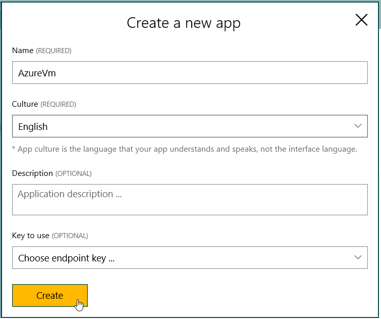

9. V nabídce vlevo přejděte na **Intents**.

   ​	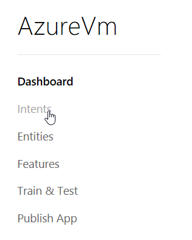

10. Klikněte na new **Add Intent** a zadejte název (např. *StartStop*).

11. Potvrďte tlačítkem **Save**.

12. Do políčka pod Utterances napište první vzorovou větu "*start vm moje*".

    ​	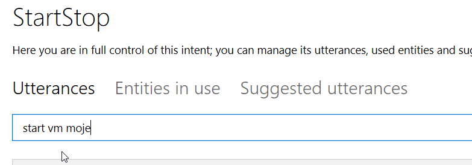

13. Potvrďte klávesou **Enter**. Věta se přidá do seznamu.

14. Najeďte myší na slovo *moje*, klikněte na něj, zadejte název nové entity "*name*" a poté klikněte na **Create entity**.

    ​	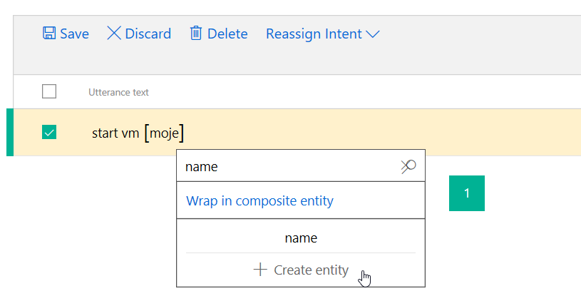

15. Vraťte se zpět do políčka se zadáváním věty a přidejte další varianty:

    1. "*vm start moje*"
    2. "*turn on moje*"
    3. "*turn moje on*"
    4. "*start machine moje*"

16. A následně označte v každé větě v seznamu slovo "moje" jako entitu name.

    ​	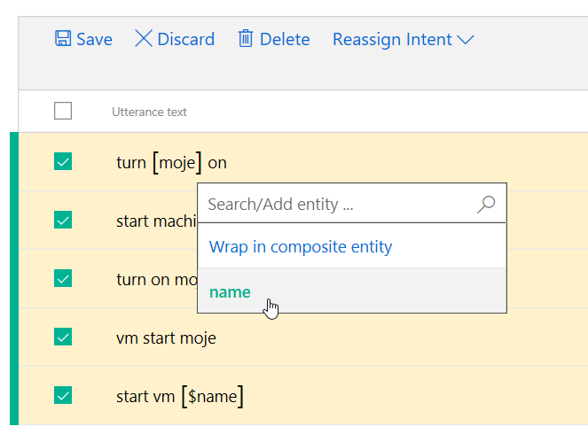

17. Nakonec uložte změny tlačítkem **Save**.

Základní jednoduchý model je připravený, teď je na čase ho vytrénovat a začít používat.

1. Klikněte v levé nabídce na **Train & Test**.

2. Klikněte na tlačítko **Train Application**.

3. Počkejte pár vteřin, než trénování doběhne.

4. Vyzkoušejte v okně **Interactive Testing** pár vět.

   ​	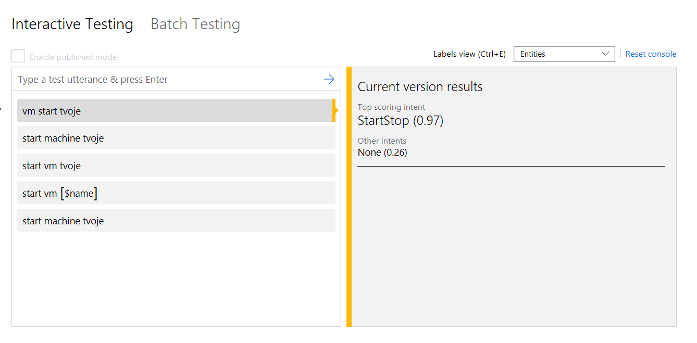

Vidíte, že intent byl rozpoznaný správně, ale systém nepoznává entitu. Funguje to v případě, kdy ji zadáme přesně - "start vm moje". Je potřeba ukázat mu víc příkladů.

1. Vraťte se zpět do části **Intents**.
2. Vyberte intent **StartStop**.
3. Přidejte dalších pár vět:
   1. "*start vm tvoje*"
   2. "*vm start tvoje*"
   3. "*start machine tvoje*"
4. A opět označte, že slovo "tvoje" je entitou name.
5. Uložte tlačítkem **Save**.
6. Vraťte se do **Train & Test** a znovu přetrénujte aplikaci.
7. Když teď zkusíte "*start vm martinovo*", systém už by měl správně poznat, že "martinovo" je entita, přestože ji nikdy předtím neviděl.

Úplně na závěr přejděte do části **Publish App** a klikněte na tlačítko **Publish**.

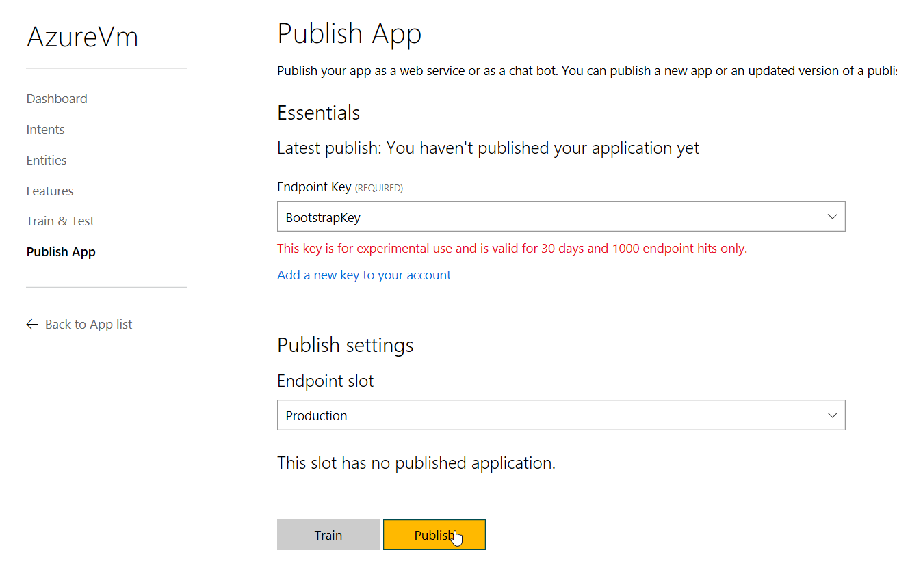

Portál vám vygeneruje Endpoint URL, kterou budete moct použít pro volání svého modelu. Jednoduše stačí na něj metodou GET poslat v parametru `q=` větu, kterou chcete analyzovat.

```
https://westus.api.cognitive.microsoft.com/luis/v2.0/apps/2388c69a-f989-40e0-b8f4-7ff031bac5ec?subscription-key=bdfb3b79090aaaaaaaaaaaaa&verbose=true&timezoneOffset=0&q=
```

Takže například takto:

```
https://westus.api.cognitive.microsoft.com/luis/v2.0/apps/2388c69a-f989-40e0-b8f4-7ff031bac5ec?subscription-key=bdfb3b79090aaaaaaaaaaaaaaaaaa&verbose=true&timezoneOffset=0&q=start%20machine%20masina
```

Výsledek:

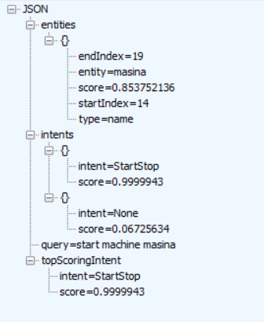

Tímto způsobem byste API napojili do své vlastní aplikace nebo do chatbota.