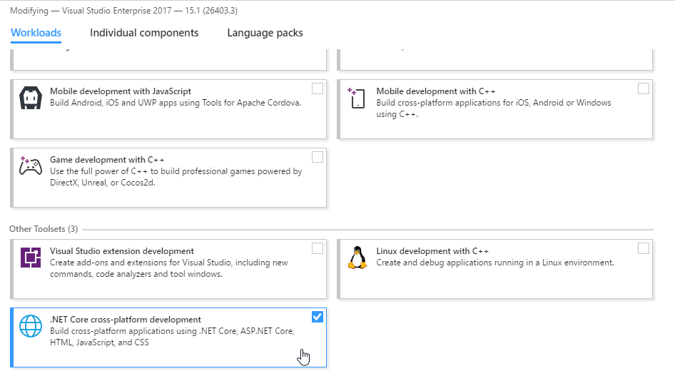
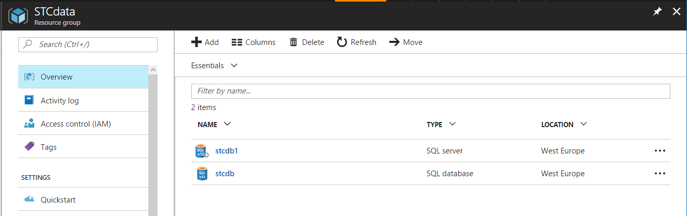
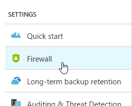
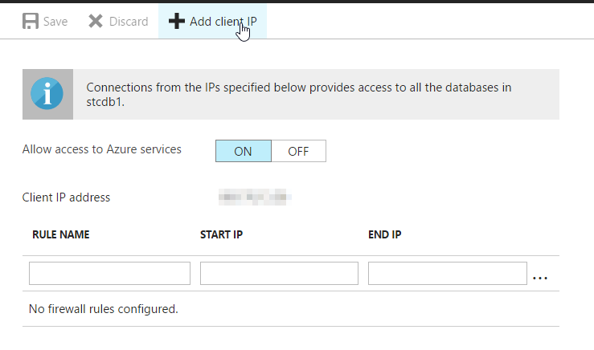
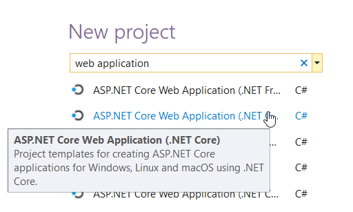
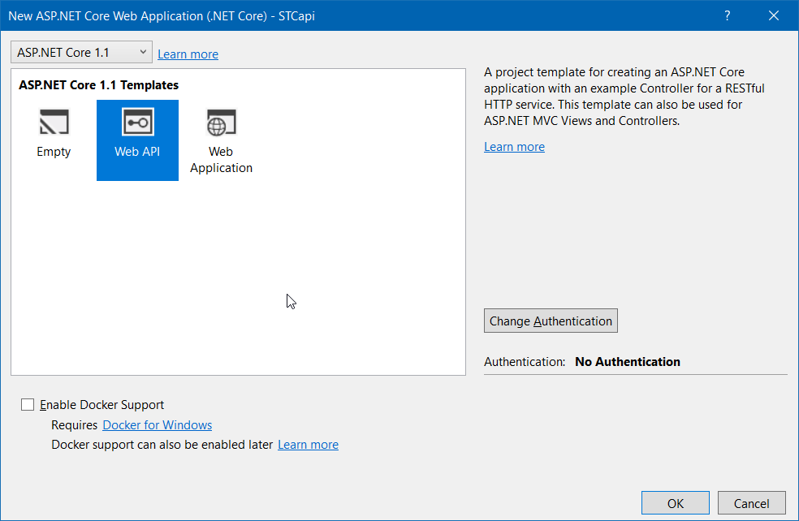
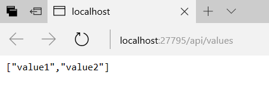

# Datové služby - Azure SQL Database

ABCD

Klíčové kroky:

* vytvořit nový databázový server
* založit ASP.NET Core WebAPI
* přidat Entity Framework Core
* sestavit základní strukturu databáze v C#
* přidat novou migraci
* update-database
* vytvořit CRUD API
* vložit pár záznamů přes Fiddler/Postman/Swagger?
* získat je zpět

## 0. Příprava

V tomto cvičení budeme opět pracovat s Visual Studiem. Pokud ho ještě nemáte, stáhněte a nainstalujte si [zdarma Community Edition](https://www.visualstudio.com/thank-you-downloading-visual-studio/?sku=Community&rel=15).

Při instalaci zaškrtněte **.NET Core cross-platform development**.

> Pokud již Visual Studio máte, můžete .NET Core přidat, když vyhledáte v nabídce Start **Visual Studio Installer** a doplníte patřičný boxík.

## 1. Tvorba Azure SQL Database

Přihlašte se na [portál Microsoft Azure](https://portal.azure.com).

Klikněte na **New** a vyhledejte *"SQL Database"*.

Vyberte **SQL Database** od Microsoftu.

Vyplňte údaje o databázi:

1. libovolný **Database name**,
2. **Subscription** ponechte (pokud máte účtů více, zvolte ten preferovaný),
3. vytvořte novou (Create new) **Resource Group** s libovolným názvem,
4. jako source ponechte **Blank database**,
5. klikněte na Server
   1. klikněte na **Create a new server**,
   2. zdajte platný **Server name** (bude tvořit URL adresu, musí být unikátní),
   3. jako **Server admin login** zadejte "*sqladmin*",
   4. jako **Password** zadejte "*Pass@word1*",
   5. jako **Location** zvolte **West Europe**,
   6. potvrďte tlačítkem **Select**.
6. ponechte **SQL elastic pool** na **Not now**,
7. **Pricing tier** změňte na **Basic** a ujistěte se, že je vybráno *5 DTU* a *2 GB Storage,*
   1. Nezapomeňte potvrdit tlačítkem **Apply**.
8. ponechte **Collation** na výchozí hodnotě,
9. potvrďte **Create**.

Azure nyní vytvoří server a databázi, celý proces trvá několik minut. Jakmile skončí uvidíte v nové Resource Group dvě položky.

## 2. Základní nastavení datbáze

Ihned po vytvoření není databáze přístupná z internetu - chrání ji firewall Azure. Abychom s ní ale mohli v průběhu vývoje pracovat, je potřeba na serveru povolit svou IP adresu.

1. Vyberte právě vytvořený server. Má velmi podobnou ikonu jako databáze - orientujte se podle sloupce *TYPE*, v němž musí být napsáno **SQL server**.

2. V levé nabídce klikněte na **Firewall**.

   

3. V hodním menu vyberte **Add client IP**.

   

4. Uložte tlačítkem **Save**.

> Určitě jste si všimli, že je možné zadat i **rozsah IP adres**. To se může hodit, pokud pracujete s databází ze sítě, jež má přidělované veřejné adresy z daného rozsahu (například v kanceláři nebo ve škole).

## 3. Tvorba Web API

Nyní je na čase vytvořit Web API, které využije právě vytvořenou databázi. V rámci tohoto cvičení sestavíme jednoduchý úkolníček pomocí ASP.NET Core a Entity Framework Core.

> Pokud nemáte nainstalované Visual Studio, můžete to ještě [dohnat zde](https://www.visualstudio.com/thank-you-downloading-visual-studio/?sku=Community&rel=15). 

1. Spusťte **Visual Studio 2017**. Pokud bude vyžadovat přihlášení, použijte stejný Microsoft Account, který používáte pro Azure.

2. V sekci **New project** vyhledejte "web application" a vyberte **ASP.NET Core Web Application (.NET Core)**. Dejte pozor, v tomto případě, na rozdíl od minulé hodiny, netvoříme ASP.NET Web Application!

   ​	

3. Pojmenujte projekt podle libosti a uložte.

4. V dialogu typu aplikace zvolte Web API.

   

5. Potvrďte **OK**.

6. Jakmile se projekt vytvoří, zkuste ho spustit pomocí **F5**.

   

1. Přidat NuGet Entity Framework Core
2. Přidat složku DB
3. Přidat Class -> Task
4. ​