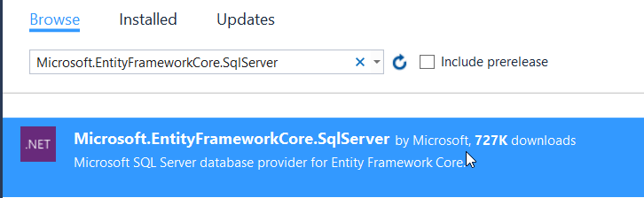

# Datové služby - Azure SQL Database

ABCD

Klíčové kroky:

* založit novou databázi Azure SQL Database,
* založit aplikaci ASP.NET Core WebAPI,
* přidat Entity Framework Core,
* sestavit základní strukturu pomocí C# a Code-First,
* zanést do Azure SQL,
* vytvořit CRUD API pro čtení a zápis do databáze,
* vložit a přečíst několik záznamů

## 0. Příprava

V tomto cvičení budeme opět pracovat s Visual Studiem. Pokud ho ještě nemáte, stáhněte a nainstalujte si [zdarma Community Edition](https://www.visualstudio.com/thank-you-downloading-visual-studio/?sku=Community&rel=15).

Při instalaci zaškrtněte **.NET Core cross-platform development**.

> Pokud již Visual Studio máte, můžete .NET Core přidat, když vyhledáte v nabídce Start **Visual Studio Installer** a doplníte patřičný boxík.


## 1. Tvorba Azure SQL Database

Přihlašte se na [portál Microsoft Azure](https://portal.azure.com).

Klikněte na **New** a vyhledejte *"SQL Database"*.

Vyberte **SQL Database** od Microsoftu.

Vyplňte údaje o databázi:

1. libovolný **Database name**,
2. **Subscription** ponechte (pokud máte účtů více, zvolte ten preferovaný),
3. vytvořte novou (Create new) **Resource Group** s libovolným názvem,
4. jako source ponechte **Blank database**,
5. klikněte na Server
   1. klikněte na **Create a new server**,
   2. zdajte platný **Server name** (bude tvořit URL adresu, musí být unikátní),
   3. jako **Server admin login** zadejte "*sqladmin*",
   4. jako **Password** zadejte "*Pass@word1*",
   5. jako **Location** zvolte **West Europe**,
   6. potvrďte tlačítkem **Select**.
6. ponechte **SQL elastic pool** na **Not now**,
7. **Pricing tier** změňte na **Basic** a ujistěte se, že je vybráno *5 DTU* a *2 GB Storage,*
   1. Nezapomeňte potvrdit tlačítkem **Apply**.
8. ponechte **Collation** na výchozí hodnotě,
9. potvrďte **Create**.

Azure nyní vytvoří server a databázi, celý proces trvá několik minut. Jakmile skončí, uvidíte v nové Resource Group dvě položky:


## 2. Základní nastavení datbáze

Ihned po vytvoření není databáze přístupná z internetu - chrání ji firewall Azure. Abychom s ní ale mohli v průběhu vývoje pracovat, je potřeba na serveru povolit svou IP adresu.

1. Přejděte do nové Resource Group a vyberte právě vytvořený server. Má velmi podobnou ikonu jako databáze - orientujte se podle sloupce *TYPE*, v němž musí být napsáno **SQL server**.

2. V levé nabídce klikněte na **Firewall**.

   

3. V hodním menu vyberte **Add client IP**.

   

4. Uložte tlačítkem **Save**.

> Určitě jste si všimli, že je možné zadat i **rozsah IP adres**. To se může hodit, pokud pracujete s databází ze sítě, jež má přidělované veřejné adresy z daného rozsahu (například v kanceláři nebo ve škole).

Projděte si ještě další nastavení a informace, které jsou na portále k dispozici. Zajímavý je hlavně přehled DTU a potom detaily konkrétní databáze (třeba Geo-Replication).


## 3. Tvorba Web API

Nyní je na čase vytvořit Web API, které využije právě vytvořenou databázi. V rámci tohoto cvičení sestavíme jednoduché API pro ukládání zajímavých odkazů na později pomocí ASP.NET Core a Entity Framework Core.

> Pokud nemáte nainstalované Visual Studio, můžete to ještě [dohnat zde](https://www.visualstudio.com/thank-you-downloading-visual-studio/?sku=Community&rel=15). 

1. Spusťte **Visual Studio 2017**. Pokud bude vyžadovat přihlášení, použijte stejný Microsoft Account, který používáte pro Azure.

2. V sekci **New project** vyhledejte "*web application*" a vyberte **ASP.NET Core Web Application (.NET Core)**. Dejte pozor, v tomto případě, na rozdíl od minulé hodiny, netvoříme ASP.NET Web Application!

   ​	

3. Pojmenujte projekt podle libosti a uložte.

4. V dialogu typu aplikace zvolte Web API.

   

5. Potvrďte **OK**.

6. Jakmile se projekt vytvoří, zkuste ho spustit pomocí **F5**.

   

Výchozí projekt Web API v ASP.NET Core generuje jednoduchý controller, který vrací pole o dvou hodnotách.

### Příprava databáze Code-First

V tomto cvičení využijeme metodu Code-First, kdy definujeme strukturu databáze kódem v C#. Začneme tím, že přidáme NuGet balíček Entity Frameworku a připravíme patřičné C# třídy.

1. Zastavte běžící aplikaci.

2. Klikněte pravým tlačítkem na projekt v Solution Exploreru.

3. Vyberte **Manage NuGet Packages...**

4. V sekci **Browse** vyhledejte knihovnu **Microsoft.EntityFrameworkCore.SqlServer** a nainstalujte ji.

   ​	

5. Klikněte v Solution Exploreru pravým tlačítkem na projekt a zvolte **Add > New Folder**.

6. Pojmenujte složku **DB**.

7. Klikněte na ni pravým tlačítkem a zvolte **Add > Class...**

8. Pojmenujte soubor **Links.cs**.

9. Vytvořte základní strukturu tabulky jako C# třídu:

```c#
public class Links
{
   public int Id { get; set; }
   public string Link { get; set; }
   public DateTime CreatedAt { get; set; }
   public bool Read { get; set; }
}
```

9. Klikněte pravým tlačítkem na složku DB a vytvořte další třídu (**Add > Class...**).

10. Pojmenujte ji **DataContext.cs**.

   1. Třída DataContext dědí od **DbContext** a definuje strukturu naší databáze.

11. Doplňte implementaci:

```c#
public class DataContext : DbContext
{
   public DbSet<Links> Links { get; set; }

   public DataContext(DbContextOptions<DataContext> options) : base(options) { }
}
```

> Aby byl kód validní, je potřeba ještě na začátek souboru přidat patřičný using.
>
> ```
> using Microsoft.EntityFrameworkCore;
> ```

Tím jsme připravili základní strukturu databáze, ale naše aplikace o ní ještě neví. Následuje registrace v kontejneru Dependency Injection (DI).

1. Otevřete soubor **Startup.cs**.
2. Do těla metody **ConfigureServices** pod `services.AddMvc();` vložte:

  ```c#
  services.AddDbContext<DB.DataContext>(options =>
          options.UseSqlServer(Configuration.GetConnectionString("DefaultConnection")));
  ```

3. Nahoru, do sekce k ostatním řádkům using, přidejte:

  ```
  using Microsoft.EntityFrameworkCore;
  ```

4. Otevřete soubor appsettings.json a přidejte do něj **za první složenou závorku** tento atribut:

  ```
  "ConnectionStrings": {
    "DefaultConnection": ""
  },
  ```

Nyní už chybí jen získat **Connection String** naší databáze. Zkopírujeme ho z portálu Azure.

1. Vraťte se zpět do portálu a otevřte svou SQL databázi.

2. V sekci Essentials klikněte na **Show database connection strings**.

   ​	

3. Zkopírujte si ADO.NET connection string. (Dejte pozor, abyste ho vybrali celý!)

   ​	

4. Vložte jej ve Visual Studiu do prázdného řetězce u **DefaultConnection** v souboru *appsettings.json* a nahraďte jméno a heslo přihlašovacími údaji vaší databáze (`sqladmin`, `Pass@word1`).

5. Výsledný appsettings.json bude vypadat takto:


```json
{
  "ConnectionStrings": {
    "DefaultConnection": "Server=tcp:<váš server>.database.windows.net,1433;Initial Catalog=<vaše db>;Persist Security Info=False;User ID=sqladmin;Password=Pass@word1;MultipleActiveResultSets=False;Encrypt=True;TrustServerCertificate=False;Connection Timeout=30;"
  },
  "Logging": {
    "IncludeScopes": false,
    "LogLevel": {
      "Default": "Warning"
    }
  }
}
```

Nyní už zbývá jen změny propsat do skutečné databáze v cloudu. Protože budeme chtít později měnit schéma, použijeme hned od začátku migrace Entity Frameworku.

1. Otevřte ve Visual Studiu panel **Package Manager Console**.

   1. Pokud jej nemáte v dolní části okna, najdete ho pod View > Other Windows > Package Manager Console.
2. Zadejte příkaz: `Install-Package Microsoft.EntityFrameworkCore.Tools`.

 > Install-Package je alternativou NuGet Package Manageru.

3. Poté zadejte: `Add-Migration Init`.

4. A nakonec: `Update-Database`.

5. Výsledek v konzoli by měl vypadat takto:

   ​	PM> Add-Migration Init
   ​	To undo this action, use Remove-Migration.
   ​	PM> Update-Database
   ​	Done.

Pokud se budete chtít podívat, co se s databází stalo, můžete použít panel **Server Explorer** (View > Server Explorer). Po přihlášení vaším Azure účtem uvidíte v SQL Databases svou databázi a když na ni kliknete pravým tlačítkem a zvolíte **Open in SQL Server Object Explorer**, budete se moct připojit a podívat se, jak vypadají vytvořené tabulky (v našem případě jedna).


### Zápis a čtení

Nyní zbývá jen začít databázi ovládat - číst z ní a zapisovat. Bude k tomu sloužit nový Controller.

1. Klikněte pravým tlačítkem na složku **Controllers** v Solution Exploreru.

2. Vyberte **Add > New Item...** (**NE**klikejte rovnou na Controller).

3. V sekci **Web** vyberte **Web API Controller Class**.

4. Pojmenujte soubor **LinksController.cs**.

   ​	

5. Nahraďte kód tímto:

```c#
using Microsoft.AspNetCore.Mvc;
using STCapi.DB;
using System;
using System.Collections.Generic;
using System.Linq;

namespace STCapi.Controllers
{
    [Route("api/[controller]")]
    public class LinksController : Controller
    {
        private DataContext _dbContext;

        public LinksController(DataContext dbContext)
        {
            _dbContext = dbContext;
        }

        // GET api/links
        [HttpGet]
        public IEnumerable<Links> Get()
        {
            return _dbContext.Links.ToList();
        }

        // GET api/links/5
        [HttpGet("{id}")]
        public Links Get(int id)
        {
            throw new NotImplementedException();
        }

        // POST api/links
        [HttpPost]
        public IActionResult Post([FromBody]Links value)
        {
            _dbContext.Links.Add(value);
            _dbContext.SaveChanges();

            return Ok();
        }

        // PUT api/links/5
        [HttpPut("{id}")]
        public IActionResult Put(int id, [FromBody]Links value)
        {
            throw new NotImplementedException();
        }

        // DELETE api/links/5
        [HttpDelete("{id}")]
        public IActionResult Delete(int id)
        {
            throw new NotImplementedException();
        }
    }
}
```

Aby vše fungovalo ve vašem projektu, **je potřeba nahradit** `STCapi` namespace vašeho projektu (najdete ho například nad třídou DataContext).

> V tomto controlleru implementujeme dvě metody:
>
> * **Get** pro vrácení všech odkazů z databáze,
>
> * **Post** pro vytvoření nového.
>
> Ostatní metody hodí chybu. Jejich implementace je na vás - jako samostatné cvičení.

Otestovat, že API funguje můžete například pomocí nástroje [Telerik Fiddler](http://www.telerik.com/fiddler) nebo [Postman](https://www.getpostman.com/). V obou případech musíte nejprve API nastartovat ve Visual Studiu (F5) a poté na jeho adresu (např. http://localhost:1234/api/links) poslat metodou POST testovací data:

```json
{
  "createdAt": "2017-04-3",
  "link": "http://mujweb.cz"
}
```

Metoda GET na stejnou adresu ukáže, jestli jste byli úspěšní.

## 4. Úpravy databáze

Poslední krok, který v tomto cvičení uděláme, je přidání nového sloupce do databáze.

1. Ve Visual Studiu otevřte soubor Links.cs.

2. Pod public bool Read... přidejte novou property:

   ```c#
   public string Tag { get; set; }
   ```

3. V Package Manager Console zavoltejte:

   ```
   Add-Migration Tag
   Update-Database
   ```

Pokud všechno projde, přidali jste do tabulky nový sloupec.