# IoT

V jediném cvičení této části postupně projdeme vytvoření jednoduchého cloudového IoT řešení. Jako zdroj dat nám bude sloužit aplikace simulující rychlost dvou vozidel. Na konci uvidíme real-time vizualizaci dat v grafu Power BI.

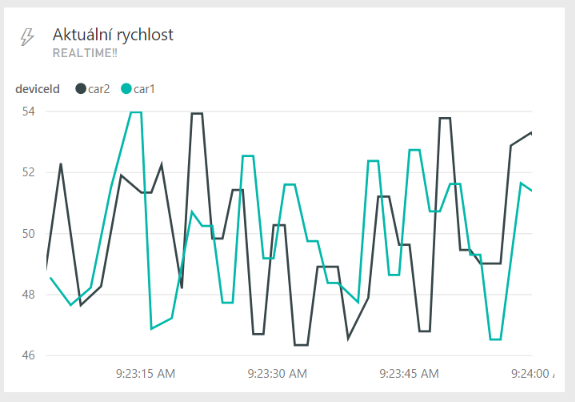

## 1. Příprava infrastruktury

Budeme spojovat tři služby: IoT Hub, Stream Analytics a Power BI. Proto nejprve připravíme celou cloudovou infrastrukturu, s níž budeme pracovat.

1. Přihlašte se do portálu [Microsoft Azure](https://portal.azure.com).
2. Klikněte **+ New** a vyhledejte *IoT Hub*.
3. Vyberte ten od Microsoftu a klikněte **Create**.
4. Zadejte **název** - například *autahub*.
5. **Pricing and scale tier** změňte na **Free** (nezapomeňte potvrdit tlačítkem **Select**).
   1. Free IoT Hub může být na jednom účtu pouze jeden, takže pokud už nějaký máte z dřívějška, budete muset vybrat Standard.
6. **Resource group** vytvořte novou s libovolným názvem.
7. **Location** nastavte na **North Europe**.
8. Potvrďte tlačítkem **Create**.

Začne se vytvářet IoT Hub. Nebudeme čekat, až tvorba skončí, a rovnou připravíme i Stream Analytics.

1. Přejděte do nové Resource Group a klikněte nahoře na **Add**.
2. Vyhledejte *Stream Analytics* a vyberte **Stream Analytics job** od Microsoftu.
3. Klikněte **Create**.
4. Zvolte si název - např. *autajob*.
5. Zbytek ponechte beze změny a klikněte **Create**.

Posledním dílkem naší cloudové IoT skládačky bude Power BI. Má dvě varianty, nás bude zajímat ta, která je součástí Office 365.

1. Otevřete pro jistotu privátní okno prohlížeče (InPrivate v MS Edge).

2. Přejděte na portál [Power BI](https://powerbi.microsoft.com).

3. Klikněte vpravo nahoře na **Sign in**.

   ​	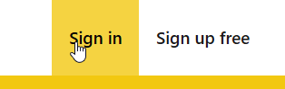

4. Přihlašte se pomocí svého **STC účtu** (*jméno@icstic.cz*).

5. Potvrďte všechny další výzvy a **přeskočte** krok zvaní dalších kontaktů do Power BI.

6. Nakonec byste se měli objevit na úvodní stránce Power BI.

   ​	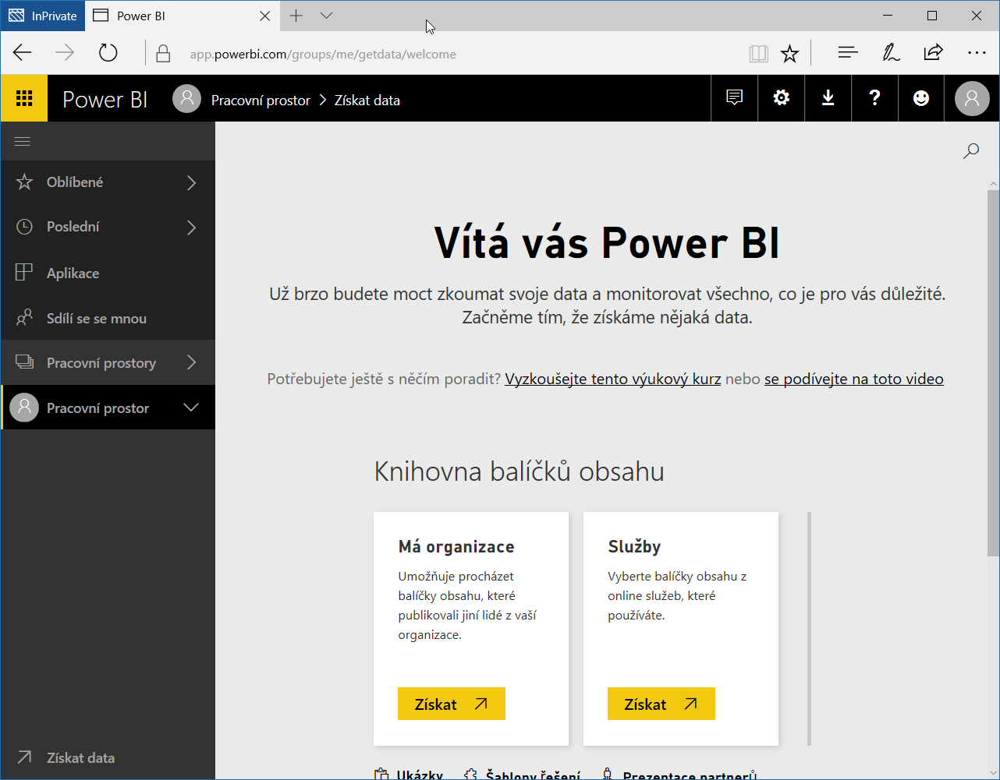

Tímto máme infastrukturu připravenou.

## 2. Konfigurace

Další důležitou částí je správně nakonfigurovat spolupráci IoT Hubu, Stream Analytics a Power BI. 

1. Vraťte se zpět na [portál Microsoft Azure](https://portal.azure.com).

2. Otevřete nově vytvořený **Stream Analytics job** (*autajob*).

3. Klikněte nejprve na **Inputs**.

   ​	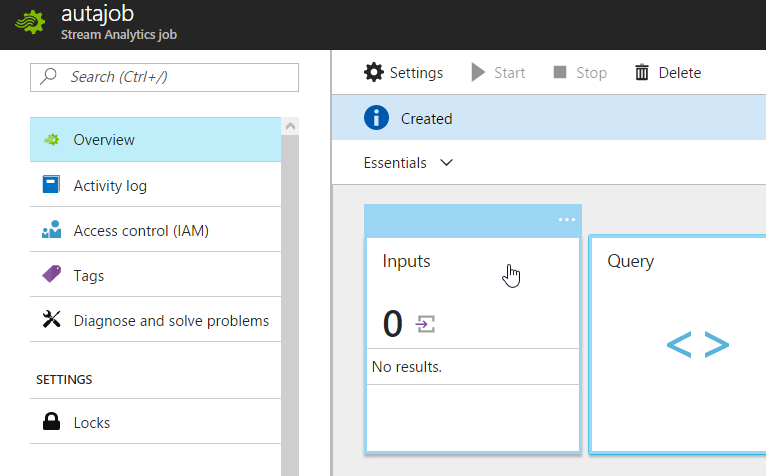

4. Poté klikněte **+ Add** vlevo nahoře.

5. Zadejte **Input alias** *iothub*.

6. **Source Type** ponechte *Data stream*.

7. **Source** změňte na **IoT hub**.

8. Nechte Azure, ať načte konfiguraci vašeho *autahub*u.

   ​	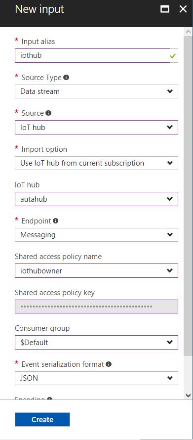

9. Potvrďte tlačítkem **Create**.

Podobně nastavíme i výstup do Power BI.

1. Klikněte ve Stream Analytics jobu na **Outputs**.

2. Zvolte nahoře **+ Add**.

3. Jako **Output alias** zadejte *powerbi*.

4. **Sink** změňte na **Power BI**.

5. Klikněte **Authorize**.

   ​	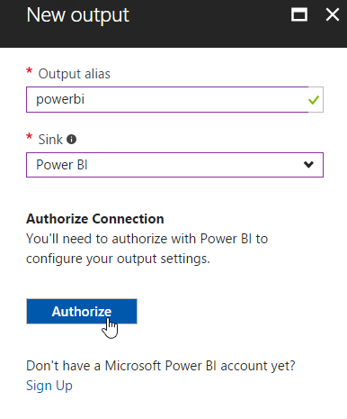

6. Přihlašte se svým **Office 365 účtem**, na němž jsme před chvílí aktivovali Power BI.

7. Po přihlášení zadejte **Dataset Name** jako *speed* a **Table Name** také *speed*.

   ​	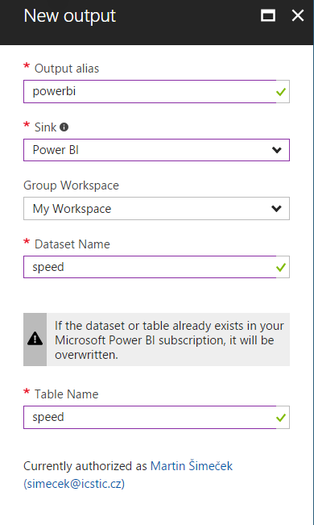

8. Potvrďte tlačítkem **Create**.

Jako poslední zbývá nastavit Query, abychom definovali, do jakého výstupu a v jakém tvaru se budou data posílat.

1. Ve Stream Analytics jobu klikněte na **Query**.
2. Nahraďte dotaz tímto:

```sql
SELECT
    *
INTO
    powerbi
FROM
    iothub
```

> Tímto dotazem říkáme: "Vezmi všechno, co přijde z *iothub*, a pošli to do *powerbi*".

Uložte tlačítkem **Save**.

Stream Analytics job je ve výchozím nastavení vypnutý, takže nezpracovává vstupy a nepřeposílá je na výstupy. Zavřete editor Query a klikněte na tlačítko **Start**, které jej aktivuje.

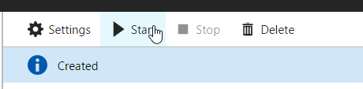

Job output start time ponechte **Now** a klikněte na tlačítko **Start** dole.

> Spuštění jobu může trvat i několik minut. Před každou změnou je potřeba jej nejprve zastavit tlačítkem Stop a poté opět nastartovat. Pokud už bude mít ve frontě nějaké zprávy, může je zpracovat, nebo může začít od aktuální chvíle.

## 3. Zdroj dat

Jako simulovaný zdroj vstupních signálů nám poslouží konzolová aplikace, která simuluje jízdu dvou aut. Každou vteřinu jedno z nich pošle svou aktuální rychlost.

1. Otevřte ve **Visual Studiu** projekt aplikace, kterou najdete ve složce **Source** v tomto repozitáři (*IoTHubDemo.sln*).
2. Stiskněte **F6** a počkejte, než doběhne build.
3. Přejděte do souboru **Program.cs** a podívejte se, co aplikace dělá.

Před tím, než může zařízení (v našem případě simulované auto) komunikovat s IoT Hubem, musí v něm být zaregistrováno. To může administrátor provést ručně (a taky se to tak dělá, pokud zařízení není mnoho), nebo se dá registrace obsloužit kódem automaticky.

V metodě `AddDeviceAsync` (řádek 48):

```c#
device1 = await registryManager.AddDeviceAsync(new Device(device1Name));
```

Následně zařízení vytáhne z registrace svůj klíč, který pak používá k posílání dat do IoT Hubu.

```c#
device1Key = device1.Authentication.SymmetricKey.PrimaryKey;
```

Nakonec už jenom v metodě `SendDeviceToCloudMessagesAsync` posíláme každou vteřinu náhodně vygenerovanou rychlost v rozmezí kolem průměru 50.

```c#
double currentSpeed = avgSpeed + rand.NextDouble() * 8 - 4;

var telemetryDataPoint = new
{
    deviceId = device1Name,
    currentSpeed = currentSpeed,
    timestamp = DateTime.Now
};
var messageString = JsonConvert.SerializeObject(telemetryDataPoint);
var message = new Microsoft.Azure.Devices.Client.Message(Encoding.ASCII.GetBytes(messageString));

await device1Client.SendEventAsync(message);
Console.WriteLine("{0} > Sending message: {1}", DateTime.Now, messageString);
```

Aby aplikace fungovala, musíme doplnit přístupové údaje k IoT Hubu.

1. Vraťte se **do portálu** Microsoft Azure a otevřete svůj **IoT Hub** (*autahub*).

2. V nabídce vlevo přejděte na **Shared access policies**.

3. Klikněte na **iothubowner**.

   ​	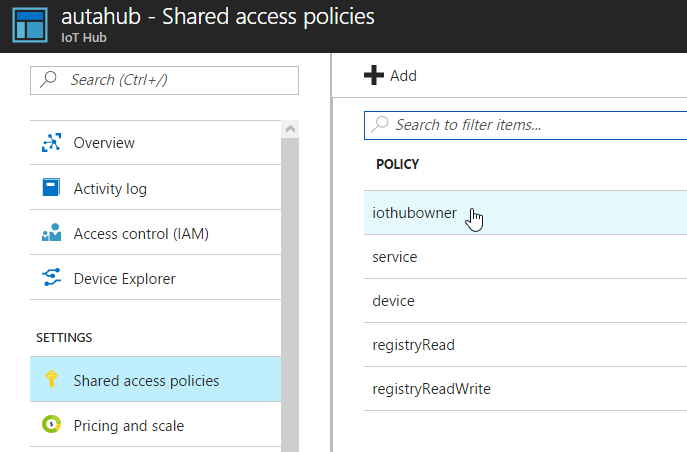

4. Zkopírujte hodnotu **Connection string - primary key**.

5. Vraťte se zpět do Visual Studia a otevřete soubor **App.config**.

6. Doplňte Connection String jako hodnotu pro `IotHubConnectionString`.

7. Změňte hodnotu `IotHubUri` tak, aby odpovídala názvu vašeho IoT Hubu (např. *autahub.azure-devices.net*).

8. Uložte a spusťte aplikaci.

Nejprve proběhne registrace zařízení a poté, po stisknutí **Enteru**, se začnou posílat data do IoT Hubu. Nechte aplikaci běžet.

## 4. Power BI Dashboard

Data nám proudí do IoT Hubu a předávají se rovnou do Power BI. Pojďme je tedy vizualizovat.

1. Otevřete [portál Power BI](https://powerbi.microsoft.com) a přihlašte se (pokud vás již stihl odhlásit).

2. Rozklikněte **My Workspace** a pod **Datasets** by vám měl naskočit dataset **speed**.

   ​	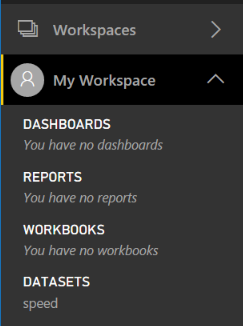

3. Vyberte ho, spustí se editor reportu Power BI.

4. Zvolte vizualizaci - **Line Chart**.

   ​	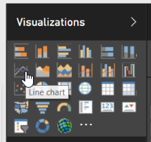

5. Přetáhněte ze seznamu vpravo pole `timestamp` do políčka **Axis**.

   ​	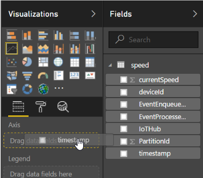

6. **Legend** bude `deviceId` a **Values** bude `currentSpeed`.

   ​	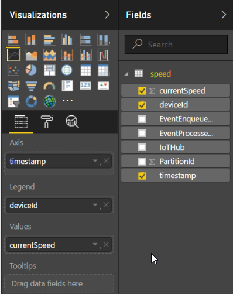

7. Měli byste vidět, jak vám vlevo postupně vzniká graf.

8. Klikněte na **Save** vpravo nahoře.

9. Pojmenujte report třeba *SpeedReport*.

10. Klikněte v grafu na **Pin visual**.

    ​	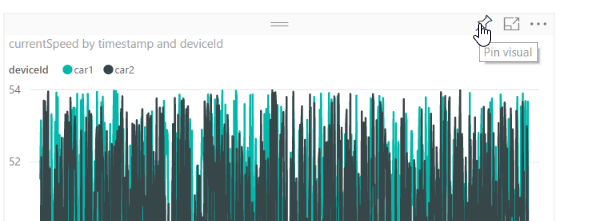

11. Zadejte název nového dashboardu - například *SpeedDashboard* - a klikněte **Pin**.

12. Klikněte **Go to Dashboard** (nebo ho vyberte v seznamu vlevo).

V tuto chvíli jsou data v grafu víceméně statická a obnovují se ručně. Přidáme proto na dashboard ještě dynamickou dlaždici s aktuálními daty.

1. Klikněte vpravo nahoře na **+ Add tile**.

2. Vyberte **Custom Streaming Data**.

   ​	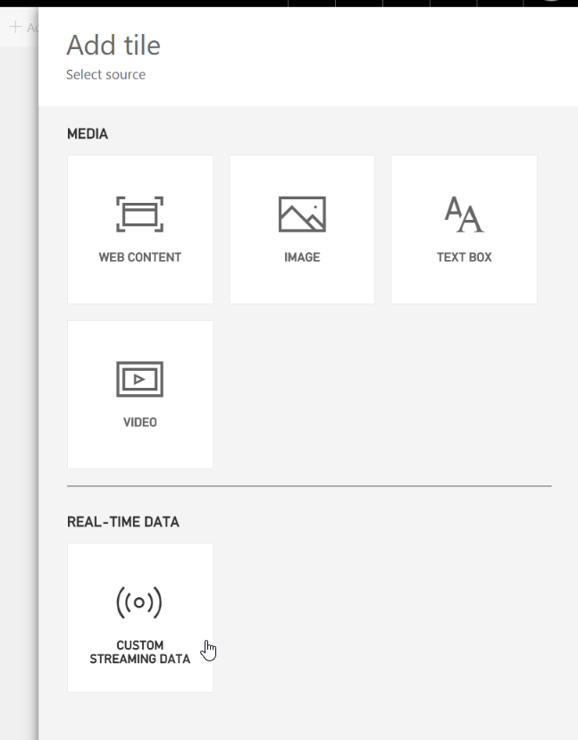

3. Klikněte **Next**.

4. Vyberte dataset *speed* a opět klikněte **Next**.

5. Změňte **Visualization Type** na **Line chart**.

   ​	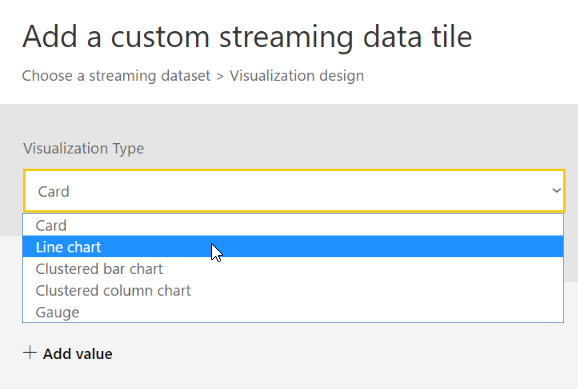

6. **Axis** bude timestamp.

7. **Legend** bude deviceId.

8. **Values** bude currentSpeed.

9. Klikněte **Next**.

10. Zvolte si **Title** a **Subtitle** a potvrďte **Apply**.

Dashboard je hotov. Samozřejmě si jej můžete různě upravovat, přeskládávat apod. Dokud bude běžet aplikace simulující jedoucí auta, bude se měnit i graf.

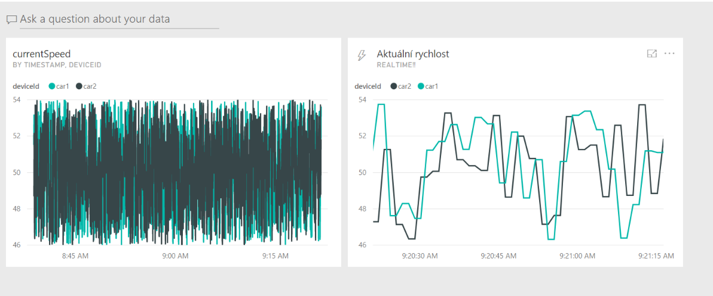


